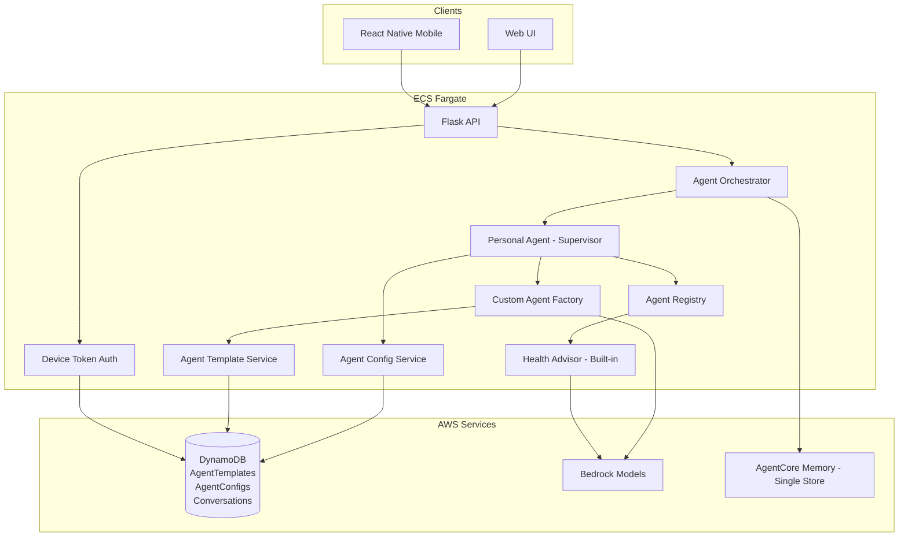
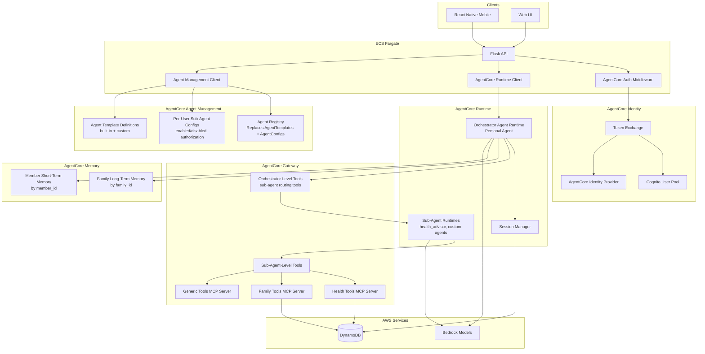
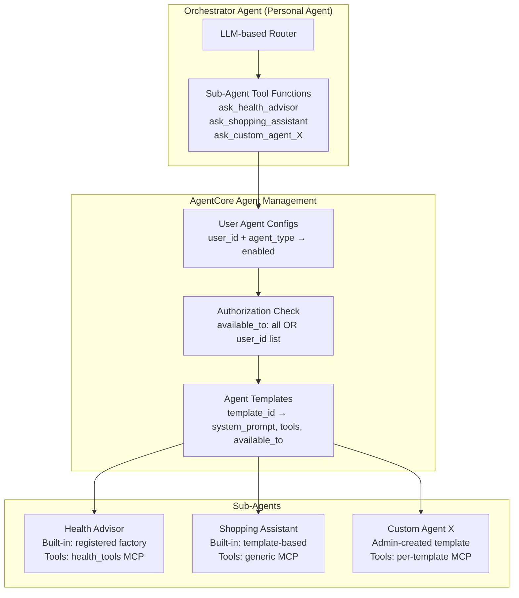
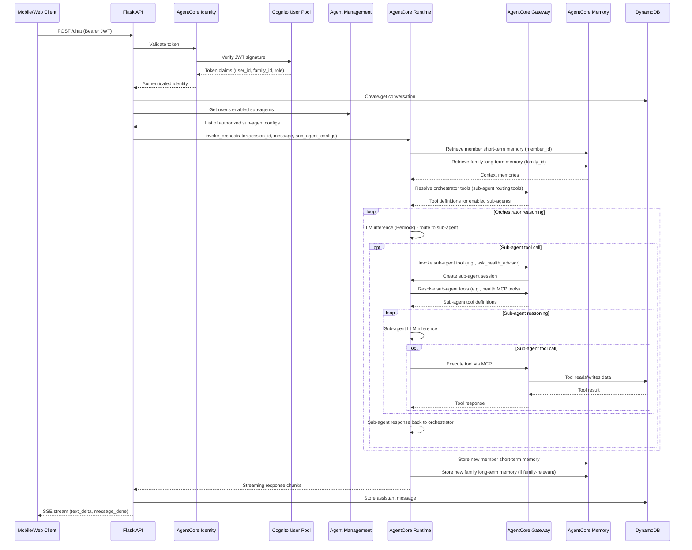
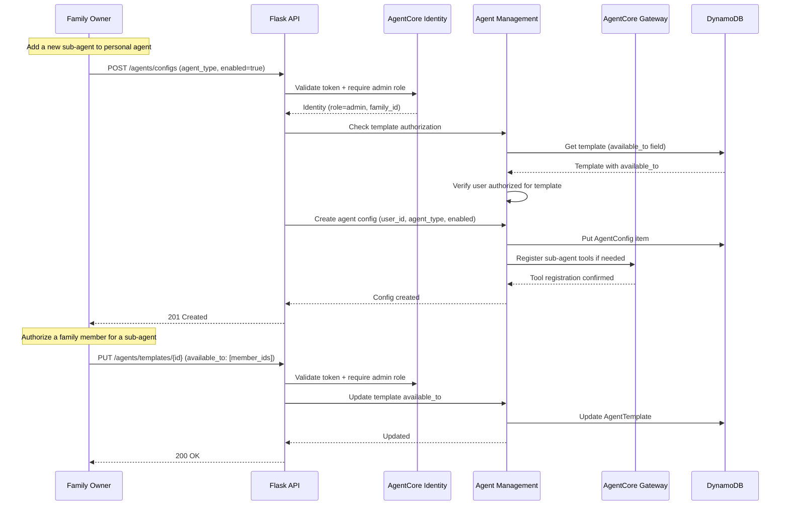
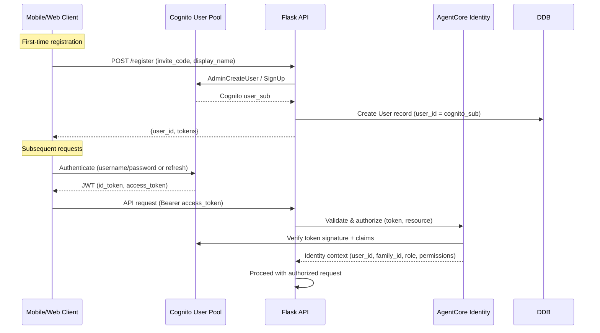

# Design Document: AgentCore Migration

## Overview

This design covers migrating the HomeAgent family agent platform from its current custom agent orchestration (Strands Agents + DynamoDB + device-token auth) to Amazon Bedrock AgentCore. The system is a family agent app where a personal orchestrator agent manages multiple sub-agents according to the family owner's requests. Sub-agents include both built-in agents (like health_advisor) and dynamically created custom agents from admin-defined templates.

The migration touches five pillars: **AgentCore Runtime** for the orchestrator agent and sub-agent session management, **AgentCore Agent Management** for configuring sub-agents (both built-in and custom template-based) and authorizing family members to access them, **AgentCore Memory** for dual-tier memory (family long-term by `family_id`, member short-term by `member_id`), **AgentCore Gateway** for centralized tool management at both orchestrator and sub-agent levels, and **AgentCore Identity** for Cognito-backed authentication and authorization.

The existing system uses a personal agent (supervisor pattern in `personal.py`) that dynamically builds sub-agent tools per user via `build_sub_agent_tools()`. It looks up the user's enabled AgentConfigs, tries registered factories first (built-in agents like health_advisor registered via `@register_agent`), then falls back to the generic custom agent factory (`custom_agent.py`) for template-defined agents. AgentTemplates define available agent types with `available_to` fields controlling member access. The migration preserves this architecture while replacing custom infrastructure with managed AgentCore services.

Key migration goals: (1) Map the personal orchestrator agent to an AgentCore Runtime managed agent that routes to sub-agents, (2) Map sub-agents (both built-in and custom) to AgentCore-managed agent configurations that can be dynamically added/removed, (3) Implement member authorization for sub-agent access using AgentCore + the existing `available_to` template field, (4) Split the single memory store into family-scoped long-term and member-scoped short-term memories, (5) Move tool definitions from Python code to AgentCore Gateway at both orchestrator and sub-agent levels, (6) Replace device-token auth with AgentCore Identity backed by the existing Cognito User Pool.

## Architecture

### Current Architecture



### Target Architecture



### Agent Routing Architecture



## Sequence Diagrams

### Chat Request Flow (Post-Migration)



### Dynamic Sub-Agent Management Flow



### Authentication Flow (Cognito → AgentCore Identity)



## Components and Interfaces

### Component 1: AgentCore Runtime Client (Orchestrator)

**Purpose**: Replaces the in-process Strands Agent instantiation in `agent_orchestrator.py`. The personal agent (orchestrator) becomes an AgentCore Runtime managed agent. It receives the user's message, resolves which sub-agents are available for this user, and routes queries to the appropriate sub-agent via tool calls.

**Interface**:
```python
class AgentCoreRuntimeClient:
    def __init__(self, agent_id: str, region: str): ...

    def create_session(
        self,
        session_id: str,
        user_id: str,
        family_id: str,
        system_prompt: str,
        memory_config: MemoryConfig,
        sub_agent_tool_ids: list[str],  # Gateway tool IDs for enabled sub-agents
    ) -> AgentSession: ...

    def invoke_session(
        self,
        session_id: str,
        message: str,
        stream: bool = True,
    ) -> Generator[StreamEvent, None, None]: ...

    def get_session(self, session_id: str) -> AgentSession | None: ...

    def delete_session(self, session_id: str) -> None: ...
```

**Responsibilities**:
- Map conversation_id to AgentCore Runtime session_id for the orchestrator
- Attach the user's authorized sub-agent tools to each session
- Attach family and member memory configurations to sessions
- Stream orchestrator agent responses back to the Flask SSE handler
- Handle session lifecycle (create on first message, reuse on subsequent)

### Component 2: Agent Management Client

**Purpose**: Replaces the current `agent_config.py` and `agent_template.py` services with AgentCore-managed agent configurations. Handles the full lifecycle of sub-agents: template definition, per-user configuration, authorization, and dynamic addition/removal. This is the core component that enables family owners to customize their personal agent's sub-agent roster.

**Interface**:
```python
class AgentManagementClient:
    def __init__(self, region: str): ...

    # --- Template Management (replaces agent_template.py) ---
    def create_agent_template(
        self,
        name: str,
        agent_type: str,
        description: str,
        system_prompt: str,
        tool_server_ids: list[str],  # Gateway tool servers for this agent type
        default_config: dict | None = None,
        available_to: str | list[str] = "all",
        is_builtin: bool = False,
    ) -> AgentTemplate: ...

    def get_template(self, template_id: str) -> AgentTemplate | None: ...

    def get_template_by_type(self, agent_type: str) -> AgentTemplate | None: ...

    def list_templates(self) -> list[AgentTemplate]: ...

    def get_available_templates(self, user_id: str) -> list[AgentTemplate]: ...

    def update_template(self, template_id: str, **updates) -> AgentTemplate | None: ...

    def delete_template(self, template_id: str) -> bool: ...

    # --- Per-User Agent Config (replaces agent_config.py) ---
    def get_user_agent_configs(self, user_id: str) -> list[AgentConfig]: ...

    def get_user_agent_config(
        self, user_id: str, agent_type: str
    ) -> AgentConfig | None: ...

    def put_user_agent_config(
        self,
        user_id: str,
        agent_type: str,
        enabled: bool = True,
        config: dict | None = None,
    ) -> AgentConfig: ...

    def delete_user_agent_config(self, user_id: str, agent_type: str) -> bool: ...

    # --- Authorization ---
    def is_user_authorized_for_template(
        self, user_id: str, template: AgentTemplate
    ) -> bool: ...

    def get_authorized_sub_agent_tools(
        self, user_id: str
    ) -> list[SubAgentToolConfig]: ...

    # --- Dynamic Sub-Agent Resolution ---
    def build_sub_agent_tool_ids(
        self, user_id: str
    ) -> list[str]: ...
```

**Responsibilities**:
- Manage agent templates (CRUD) — replaces `AgentTemplates` DynamoDB table operations
- Manage per-user agent configs (CRUD) — replaces `AgentConfigs` DynamoDB table operations
- Enforce authorization: check `available_to` field before enabling a sub-agent for a user
- Seed built-in templates on startup (health_advisor, logistics_assistant, shopping_assistant)
- Resolve the list of Gateway tool IDs for a user's enabled and authorized sub-agents
- Support family owners dynamically adding/removing sub-agents from their personal agent
- Cascade-delete agent configs when a template is deleted

### Component 3: AgentCore Gateway Manager

**Purpose**: Replaces the in-code tool definitions (`health_tools.py`, `custom_agent.py` tool creation) with AgentCore Gateway-managed tool registrations and MCP server configurations. Manages tools at TWO levels: orchestrator-level tools (sub-agent routing) and sub-agent-level tools (domain-specific tools like health tools).

**Interface**:
```python
class AgentCoreGatewayManager:
    def __init__(self, region: str): ...

    # --- Orchestrator-Level Tool Management ---
    def register_sub_agent_routing_tool(
        self,
        agent_type: str,
        description: str,
        sub_agent_runtime_id: str,
    ) -> str: ...  # Returns tool_id

    def get_orchestrator_tools(
        self, enabled_agent_types: list[str]
    ) -> list[ToolDefinition]: ...

    # --- Sub-Agent-Level Tool Management ---
    def register_tool_server(
        self,
        server_name: str,
        server_type: str,  # "mcp" | "lambda"
        endpoint: str,
        tools: list[ToolDefinition],
    ) -> str: ...

    def get_sub_agent_tools(
        self, agent_type: str
    ) -> list[ToolDefinition]: ...

    def update_tool_server(
        self, server_id: str, tools: list[ToolDefinition]
    ) -> None: ...

    def register_mcp_server(
        self,
        name: str,
        endpoint: str,
        auth_config: dict | None = None,
    ) -> str: ...

    # --- Tool Resolution ---
    def resolve_tools_for_session(
        self,
        agent_type: str,
        user_id: str,
    ) -> list[ToolDefinition]: ...
```

**Responsibilities**:
- Register orchestrator-level tools: each enabled sub-agent becomes a tool (e.g., `ask_health_advisor`, `ask_shopping_assistant`) that the orchestrator can invoke
- Register sub-agent-level tools: domain-specific tools for each sub-agent type (health tools MCP, family tools MCP, etc.)
- For built-in agents (health_advisor): register the specific MCP server with health tools (get_family_health_records, save_health_observation, etc.)
- For custom template agents: register generic MCP server or no tools (system_prompt-only agents)
- Manage tool versioning and updates via Gateway API
- Provide tool resolution for both orchestrator and sub-agent runtime sessions
- Support dynamic tool registration when new templates are created

### Component 4: AgentCore Memory Manager

**Purpose**: Replaces the current single-store `memory.py` with a dual-tier memory system. Family long-term memory persists health knowledge, family preferences, and shared context across all family members. Member short-term memory tracks per-conversation context and recent interactions.

**Interface**:
```python
class AgentCoreMemoryManager:
    def __init__(self, region: str): ...

    def get_family_memory_config(
        self, family_id: str
    ) -> FamilyMemoryConfig: ...

    def get_member_memory_config(
        self, member_id: str, session_id: str
    ) -> MemberMemoryConfig: ...

    def create_combined_session_manager(
        self,
        family_id: str,
        member_id: str,
        session_id: str,
    ) -> CombinedSessionManager: ...

    def store_family_memory(
        self, family_id: str, content: str, namespace: str
    ) -> None: ...

    def retrieve_family_memory(
        self, family_id: str, query: str, top_k: int = 10
    ) -> list[MemoryRecord]: ...

    def store_member_memory(
        self, member_id: str, session_id: str, content: str
    ) -> None: ...

    def retrieve_member_memory(
        self, member_id: str, session_id: str, query: str, top_k: int = 5
    ) -> list[MemoryRecord]: ...
```

**Responsibilities**:
- Manage two separate AgentCore Memory stores (family long-term, member short-term)
- Route memory operations based on family_id and member_id
- Configure retrieval namespaces: `/family/{familyId}/health`, `/family/{familyId}/preferences`, `/member/{memberId}/context`, `/member/{memberId}/summaries/{sessionId}`
- Provide combined session manager that merges both memory tiers for agent sessions

### Component 5: AgentCore Identity Middleware

**Purpose**: Replaces the current `auth.py` device-token lookup with Cognito JWT validation through AgentCore Identity. Maps Cognito user attributes to the application's user/family/role model.

**Interface**:
```python
class AgentCoreIdentityMiddleware:
    def __init__(
        self,
        cognito_user_pool_id: str,
        cognito_client_id: str,
        region: str,
    ): ...

    def validate_token(self, token: str) -> IdentityContext: ...

    def require_auth(self, f: Callable) -> Callable: ...

    def require_role(self, role: str) -> Callable: ...

    def get_identity_context(self) -> IdentityContext: ...
```

**Responsibilities**:
- Validate Cognito JWT access tokens on every request
- Extract user_id, family_id, and role from token claims
- Replace `g.user_id`, `g.user_name`, `g.user_role` with identity context from AgentCore Identity
- Support role-based access control (member, admin)
- Handle token refresh and expiration

## Data Models

### Agent Template Schema (AgentCore-managed, replaces AgentTemplates DynamoDB)

```python
@dataclass
class AgentTemplate:
    template_id: str          # ULID primary key
    agent_type: str           # Unique slug: "health_advisor", "shopping_assistant", etc.
    name: str                 # Display name: "Health Advisor"
    description: str          # Used as tool description for orchestrator routing
    system_prompt: str        # LLM system prompt for this sub-agent
    tool_server_ids: list[str]  # Gateway tool server IDs assigned to this agent type
    default_config: dict      # Default config merged with user overrides
    is_builtin: bool          # True for health_advisor, logistics_assistant, shopping_assistant
    available_to: str | list[str]  # "all" or list of user_ids authorized to use this template
    created_by: str           # "system" for built-ins, user_id for custom
    created_at: str           # ISO 8601
    updated_at: str           # ISO 8601
```

**Validation Rules**:
- `agent_type` must be unique across all templates (enforced via GSI)
- `available_to` must be "all" or a non-empty list of valid user_ids
- `is_builtin` templates cannot be deleted
- `system_prompt` is required for custom agents (can be empty for built-ins that use registered factories)
- `tool_server_ids` references valid Gateway tool server registrations

### Agent Config Schema (Per-user, replaces AgentConfigs DynamoDB)

```python
@dataclass
class AgentConfig:
    user_id: str              # Hash key — the user who enabled this agent
    agent_type: str           # Range key — references AgentTemplate.agent_type
    enabled: bool             # Whether this sub-agent is active for the user
    config: dict              # User-specific config overrides (merged with template defaults)
    gateway_tool_id: str | None  # Resolved Gateway tool ID for orchestrator routing
    updated_at: str           # ISO 8601
```

**Validation Rules**:
- `agent_type` must reference a valid AgentTemplate
- User must be authorized for the template (`available_to` check)
- `config` is merged: `{**template.default_config, **user_config}`

### Sub-Agent Tool Config (Runtime resolution)

```python
@dataclass
class SubAgentToolConfig:
    agent_type: str           # e.g., "health_advisor"
    tool_name: str            # e.g., "ask_health_advisor"
    description: str          # From template description
    sub_agent_runtime_id: str | None  # AgentCore Runtime ID for built-in agents
    system_prompt: str        # From template
    tool_server_ids: list[str]  # Gateway tool servers for this sub-agent
    user_config: dict         # Merged config for this user
```

### Family Memory Schema (DynamoDB)

```python
# Table: FamilyMemories
# Stores family-level long-term memory metadata and mappings
FAMILY_MEMORIES_TABLE = {
    "TableName": "FamilyMemories",
    "KeySchema": [
        {"AttributeName": "family_id", "KeyType": "HASH"},
        {"AttributeName": "memory_key", "KeyType": "RANGE"},
    ],
    "AttributeDefinitions": [
        {"AttributeName": "family_id", "AttributeType": "S"},
        {"AttributeName": "memory_key", "AttributeType": "S"},
        {"AttributeName": "category", "AttributeType": "S"},
        {"AttributeName": "updated_at", "AttributeType": "S"},
    ],
    "GlobalSecondaryIndexes": [
        {
            "IndexName": "category-index",
            "KeySchema": [
                {"AttributeName": "family_id", "KeyType": "HASH"},
                {"AttributeName": "category", "KeyType": "RANGE"},
            ],
            "Projection": {"ProjectionType": "ALL"},
        },
        {
            "IndexName": "updated-index",
            "KeySchema": [
                {"AttributeName": "family_id", "KeyType": "HASH"},
                {"AttributeName": "updated_at", "KeyType": "RANGE"},
            ],
            "Projection": {"ProjectionType": "ALL"},
        },
    ],
}

# Item structure:
# {
#     "family_id": "fam_01JXYZ...",
#     "memory_key": "health/allergy/peanut",
#     "category": "health",           # health | preferences | context
#     "content": "Family member Alice has peanut allergy...",
#     "source_member_id": "usr_01ABC...",
#     "agentcore_memory_id": "mem-family-xxx",
#     "created_at": "2025-01-15T...",
#     "updated_at": "2025-01-15T...",
#     "ttl": None,  # Long-term: no expiry
# }
```

**Validation Rules**:
- `family_id` must reference a valid family group
- `category` must be one of: `health`, `preferences`, `context`
- `memory_key` follows hierarchical format: `{category}/{subcategory}/{identifier}`
- `content` max length: 10,000 characters

### Member Memory Schema (DynamoDB)

```python
# Table: MemberMemories
# Stores member-level short-term memory metadata
MEMBER_MEMORIES_TABLE = {
    "TableName": "MemberMemories",
    "KeySchema": [
        {"AttributeName": "member_id", "KeyType": "HASH"},
        {"AttributeName": "session_id", "KeyType": "RANGE"},
    ],
    "AttributeDefinitions": [
        {"AttributeName": "member_id", "AttributeType": "S"},
        {"AttributeName": "session_id", "AttributeType": "S"},
        {"AttributeName": "created_at", "AttributeType": "S"},
    ],
    "GlobalSecondaryIndexes": [
        {
            "IndexName": "created-index",
            "KeySchema": [
                {"AttributeName": "member_id", "KeyType": "HASH"},
                {"AttributeName": "created_at", "KeyType": "RANGE"},
            ],
            "Projection": {"ProjectionType": "ALL"},
        },
    ],
}

# Item structure:
# {
#     "member_id": "usr_01ABC...",
#     "session_id": "conv_01DEF...",
#     "agentcore_memory_id": "mem-member-xxx",
#     "summary": "Discussed child's fever symptoms...",
#     "message_count": 12,
#     "created_at": "2025-01-15T...",
#     "updated_at": "2025-01-15T...",
#     "ttl": 1737936000,  # Short-term: 30-day TTL
# }
```

**Validation Rules**:
- `member_id` must reference a valid user_id in Users table
- `session_id` must reference a valid conversation_id
- `ttl` is auto-set to 30 days from creation (short-term memory expiry)
- `message_count` is incremented on each session interaction

### Family Groups Schema (DynamoDB)

```python
# Table: FamilyGroups
# Maps users to family groups for memory scoping
FAMILY_GROUPS_TABLE = {
    "TableName": "FamilyGroups",
    "KeySchema": [
        {"AttributeName": "family_id", "KeyType": "HASH"},
        {"AttributeName": "member_id", "KeyType": "RANGE"},
    ],
    "AttributeDefinitions": [
        {"AttributeName": "family_id", "AttributeType": "S"},
        {"AttributeName": "member_id", "AttributeType": "S"},
    ],
    "GlobalSecondaryIndexes": [
        {
            "IndexName": "member-family-index",
            "KeySchema": [
                {"AttributeName": "member_id", "KeyType": "HASH"},
            ],
            "Projection": {"ProjectionType": "ALL"},
        },
    ],
}

# Item structure:
# {
#     "family_id": "fam_01JXYZ...",
#     "member_id": "usr_01ABC...",
#     "role": "admin",           # admin | member
#     "joined_at": "2025-01-15T...",
# }
```

### Updated Users Table (Cognito Integration)

```python
# Existing Users table — add cognito_sub and family_id fields
# {
#     "user_id": "usr_01ABC...",        # Keep existing ULID
#     "cognito_sub": "a1b2c3d4-...",    # NEW: Cognito user sub
#     "family_id": "fam_01JXYZ...",     # NEW: Family group reference
#     "name": "Alice",
#     "role": "admin",
#     "created_at": "2025-01-15T...",
# }
# New GSI: cognito_sub-index (HASH: cognito_sub) for token→user lookup
```

## Algorithmic Pseudocode

### Orchestrator Chat Processing Algorithm (Post-Migration)

```python
def stream_agent_chat_v2(
    messages: list[dict],
    user_id: str,
    family_id: str,
    conversation_id: str | None = None,
    system_prompt: str | None = None,
) -> Generator[dict, None, None]:
    """
    Preconditions:
        - user_id is authenticated via AgentCore Identity
        - family_id is resolved from user's Cognito claims
        - messages is non-empty, last message has role="user"

    Postconditions:
        - Orchestrator agent routes to appropriate sub-agent(s) based on query
        - Agent response is streamed to caller
        - Member short-term memory is updated for this session
        - Family long-term memory is updated if health/family-relevant content detected
        - Conversation and messages are persisted in DynamoDB

    Loop Invariants:
        - Each streamed chunk is a valid StreamEvent
        - Memory state remains consistent throughout streaming
    """
    # Step 1: Resolve or create conversation
    if conversation_id is None:
        conversation = create_conversation(user_id, title=messages[-1]["content"][:50])
        conversation_id = conversation["conversation_id"]

    # Step 2: Resolve user's authorized and enabled sub-agents
    agent_mgmt = AgentManagementClient(region=config.AWS_REGION)
    sub_agent_tool_ids = agent_mgmt.build_sub_agent_tool_ids(user_id)

    # Step 3: Initialize AgentCore Runtime client for orchestrator
    runtime_client = AgentCoreRuntimeClient(
        agent_id=config.AGENTCORE_ORCHESTRATOR_AGENT_ID,
        region=config.AWS_REGION,
    )

    # Step 4: Build memory configuration (dual-tier)
    memory_manager = AgentCoreMemoryManager(region=config.AWS_REGION)
    memory_config = memory_manager.create_combined_session_manager(
        family_id=family_id,
        member_id=user_id,
        session_id=conversation_id,
    )

    # Step 5: Create or resume orchestrator session with sub-agent tools
    session = runtime_client.get_session(conversation_id)
    if session is None:
        personalized_prompt = build_system_prompt(user_id, system_prompt)
        session = runtime_client.create_session(
            session_id=conversation_id,
            user_id=user_id,
            family_id=family_id,
            system_prompt=personalized_prompt,
            memory_config=memory_config,
            sub_agent_tool_ids=sub_agent_tool_ids,
        )

    # Step 6: Invoke orchestrator with streaming
    user_message = messages[-1]["content"]
    full_text = ""

    for event in runtime_client.invoke_session(
        session_id=conversation_id,
        message=user_message,
        stream=True,
    ):
        # Invariant: event is one of text_delta, tool_use, message_done, error
        if event.type == "text_delta":
            full_text += event.content
            yield {"type": "text_delta", "content": event.content}
        elif event.type == "error":
            yield {"type": "error", "content": event.content}
            return

    # Step 7: Persist and finalize
    if full_text:
        add_message(conversation_id, "assistant", full_text)
        yield {
            "type": "message_done",
            "content": full_text,
            "conversation_id": conversation_id,
        }
```

### Sub-Agent Tool Resolution Algorithm

```python
def build_sub_agent_tool_ids(user_id: str) -> list[str]:
    """
    Replaces personal.py build_sub_agent_tools(). Instead of creating in-process
    Strands @tool functions, resolves Gateway tool IDs for the user's authorized
    and enabled sub-agents.

    Preconditions:
        - user_id is a valid authenticated user
        - AgentConfigs and AgentTemplates are accessible

    Postconditions:
        - Returns list of Gateway tool IDs for enabled + authorized sub-agents
        - Each tool ID maps to a sub-agent routing tool in AgentCore Gateway
        - Unauthorized or disabled agents are excluded
        - Order is deterministic (sorted by agent_type)
    """
    configs = get_user_agent_configs(user_id)
    tool_ids = []

    for agent_cfg in sorted(configs, key=lambda c: c.agent_type):
        if not agent_cfg.enabled:
            continue

        template = get_template_by_type(agent_cfg.agent_type)
        if template is None:
            logger.warning("No template for agent type: %s", agent_cfg.agent_type)
            continue

        # Authorization check: is this user allowed to use this template?
        if not is_user_authorized_for_template(user_id, template):
            logger.warning(
                "User %s not authorized for agent %s", user_id, agent_cfg.agent_type
            )
            continue

        # Resolve or create the Gateway routing tool for this sub-agent
        gateway_tool_id = resolve_or_register_routing_tool(
            agent_type=agent_cfg.agent_type,
            description=template.description,
            system_prompt=template.system_prompt,
            tool_server_ids=template.tool_server_ids,
        )

        if gateway_tool_id:
            tool_ids.append(gateway_tool_id)
            logger.info("Enabled sub-agent %s for user %s", agent_cfg.agent_type, user_id)

    return tool_ids


def is_user_authorized_for_template(user_id: str, template: AgentTemplate) -> bool:
    """
    Preconditions:
        - user_id is non-empty
        - template is a valid AgentTemplate

    Postconditions:
        - Returns True if available_to == "all" or user_id is in available_to list
        - Returns False otherwise
        - No side effects
    """
    available_to = template.available_to
    if available_to == "all":
        return True
    if isinstance(available_to, list) and user_id in available_to:
        return True
    return False
```

### Dynamic Sub-Agent Addition Algorithm

```python
def add_sub_agent_for_user(
    user_id: str,
    agent_type: str,
    config: dict | None = None,
    requesting_user_id: str | None = None,
) -> AgentConfig:
    """
    Called when a family owner adds a new sub-agent to their personal agent
    or enables a sub-agent for a family member.

    Preconditions:
        - agent_type references a valid AgentTemplate
        - If requesting_user_id != user_id, requesting_user must be admin role
        - User must be authorized for the template (available_to check)

    Postconditions:
        - AgentConfig is created/updated for user_id + agent_type
        - Gateway routing tool is registered if not already present
        - Next chat session will include this sub-agent in orchestrator tools
        - Returns the created AgentConfig

    Loop Invariants: N/A
    """
    template = get_template_by_type(agent_type)
    if template is None:
        raise ValueError(f"Unknown agent type: {agent_type}")

    # Authorization check
    if not is_user_authorized_for_template(user_id, template):
        raise PermissionError(
            f"User {user_id} is not authorized for agent type {agent_type}"
        )

    # Role check: only admins can configure agents for other users
    if requesting_user_id and requesting_user_id != user_id:
        requesting_user = get_user(requesting_user_id)
        if requesting_user.get("role") != "admin":
            raise PermissionError("Only admins can configure agents for other users")

    # Merge config with template defaults
    merged_config = {**template.default_config, **(config or {})}

    # Ensure Gateway routing tool exists for this agent type
    gateway_tool_id = resolve_or_register_routing_tool(
        agent_type=agent_type,
        description=template.description,
        system_prompt=template.system_prompt,
        tool_server_ids=template.tool_server_ids,
    )

    # Create/update the agent config
    agent_config = put_user_agent_config(
        user_id=user_id,
        agent_type=agent_type,
        enabled=True,
        config=merged_config,
        gateway_tool_id=gateway_tool_id,
    )

    return agent_config


def remove_sub_agent_for_user(
    user_id: str,
    agent_type: str,
    requesting_user_id: str | None = None,
) -> bool:
    """
    Preconditions:
        - user_id + agent_type references an existing AgentConfig

    Postconditions:
        - AgentConfig is deleted for user_id + agent_type
        - Next chat session will NOT include this sub-agent
        - Gateway routing tool is NOT deleted (may be used by other users)
        - Returns True if config existed and was deleted
    """
    if requesting_user_id and requesting_user_id != user_id:
        requesting_user = get_user(requesting_user_id)
        if requesting_user.get("role") != "admin":
            raise PermissionError("Only admins can configure agents for other users")

    return delete_user_agent_config(user_id, agent_type)
```

### Gateway Tool Registration Algorithm (Two-Level)

```python
def register_all_tools_with_gateway(
    gateway_manager: AgentCoreGatewayManager,
) -> dict[str, str]:
    """
    Registers tools at both orchestrator and sub-agent levels.

    Preconditions:
        - MCP servers are deployed and accessible
        - Gateway manager is authenticated with proper IAM permissions

    Postconditions:
        - Orchestrator-level: sub-agent routing tools registered for each template
        - Sub-agent-level: domain-specific tools registered per agent type
        - Returns mapping of agent_type -> gateway_tool_server_id

    Loop Invariants:
        - Each registered tool server has a unique server_id
    """
    tool_server_map = {}

    # --- Sub-Agent-Level Tools ---

    # Health Advisor tools (built-in, has specific MCP server)
    health_server_id = gateway_manager.register_mcp_server(
        name="homeagent-health-tools",
        endpoint=config.HEALTH_MCP_ENDPOINT,
        auth_config={"type": "iam"},
    )
    health_tools = [
        ToolDefinition(
            name="get_family_health_records",
            description="Read health records for a family member",
            parameters={
                "target_user_id": {"type": "string", "required": True},
                "record_type": {"type": "string", "required": False},
            },
        ),
        ToolDefinition(
            name="get_health_summary",
            description="Get structured health summary grouped by record type",
            parameters={"target_user_id": {"type": "string", "required": True}},
        ),
        ToolDefinition(
            name="save_health_observation",
            description="Save a health observation from conversation",
            parameters={
                "target_user_id": {"type": "string", "required": True},
                "category": {"type": "string", "required": True},
                "summary": {"type": "string", "required": True},
                "detail": {"type": "string", "required": False},
                "confidence": {"type": "string", "required": False},
            },
        ),
        ToolDefinition(
            name="get_health_observations",
            description="Read past health observations and trends",
            parameters={
                "target_user_id": {"type": "string", "required": True},
                "category": {"type": "string", "required": False},
            },
        ),
        ToolDefinition(
            name="get_family_health_context",
            description="Get family composition, roles, and health notes",
            parameters={},
        ),
        ToolDefinition(
            name="search_health_conversations",
            description="Search past conversations for health topics",
            parameters={"keywords": {"type": "string", "required": True}},
        ),
    ]
    gateway_manager.update_tool_server(health_server_id, health_tools)
    tool_server_map["health_advisor"] = health_server_id

    # Family tools (shared across orchestrator and some sub-agents)
    family_server_id = gateway_manager.register_mcp_server(
        name="homeagent-family-tools",
        endpoint=config.FAMILY_MCP_ENDPOINT,
        auth_config={"type": "iam"},
    )
    tool_server_map["family_tools"] = family_server_id

    # --- Orchestrator-Level Tools ---
    # Each enabled sub-agent type becomes a routing tool for the orchestrator
    templates = list_templates()
    for template in templates:
        routing_tool_id = gateway_manager.register_sub_agent_routing_tool(
            agent_type=template.agent_type,
            description=template.description,
            sub_agent_runtime_id=template.agent_type,  # Used to resolve sub-agent
        )
        tool_server_map[f"routing_{template.agent_type}"] = routing_tool_id

    return tool_server_map
```

### Memory Routing Algorithm

```python
def create_combined_session_manager(
    family_id: str,
    member_id: str,
    session_id: str,
) -> CombinedSessionManager:
    """
    Preconditions:
        - family_id exists in FamilyGroups table
        - member_id is a member of family_id
        - session_id is a valid conversation identifier

    Postconditions:
        - Returns a session manager that routes to both memory tiers
        - Family memory uses family_id as actor_id (long-term, no TTL)
        - Member memory uses member_id as actor_id (short-term, 30-day TTL)
    """
    family_memory_config = AgentCoreMemoryConfig(
        memory_id=FAMILY_MEMORY_STORE_ID,
        session_id=session_id,
        actor_id=family_id,
        retrieval_config={
            "/family/{actorId}/health": RetrievalConfig(top_k=10, relevance_score=0.3),
            "/family/{actorId}/preferences": RetrievalConfig(top_k=5, relevance_score=0.7),
        },
    )

    member_memory_config = AgentCoreMemoryConfig(
        memory_id=MEMBER_MEMORY_STORE_ID,
        session_id=session_id,
        actor_id=member_id,
        retrieval_config={
            "/member/{actorId}/context": RetrievalConfig(top_k=5, relevance_score=0.5),
            "/member/{actorId}/summaries/{sessionId}": RetrievalConfig(
                top_k=3, relevance_score=0.5
            ),
        },
    )

    return CombinedSessionManager(
        family_config=family_memory_config,
        member_config=member_memory_config,
        region_name=AWS_REGION,
    )
```

### Authentication Migration Algorithm

```python
def agentcore_require_auth(f: Callable) -> Callable:
    """
    Preconditions:
        - Request contains Authorization header with Bearer JWT
        - JWT was issued by the configured Cognito User Pool

    Postconditions:
        - g.user_id is set to the application user_id (from cognito_sub mapping)
        - g.family_id is set from the user's family group
        - g.user_role is set from Cognito custom claims or DynamoDB
        - Unauthorized requests return 401
        - Forbidden requests (wrong role) return 403
    """
    @wraps(f)
    def decorated(*args, **kwargs):
        auth_header = request.headers.get("Authorization", "")
        if not auth_header.startswith("Bearer "):
            return jsonify({"error": "Missing or invalid Authorization header"}), 401

        token = auth_header[7:]

        # Step 1: Validate JWT via AgentCore Identity
        try:
            identity = agentcore_identity.validate_token(token)
        except TokenExpiredError:
            return jsonify({"error": "Token expired"}), 401
        except InvalidTokenError:
            return jsonify({"error": "Invalid token"}), 401

        # Step 2: Map cognito_sub to application user
        cognito_sub = identity.sub
        user = lookup_user_by_cognito_sub(cognito_sub)
        if not user:
            return jsonify({"error": "User not registered"}), 401

        # Step 3: Resolve family membership
        family_id = get_family_id_for_member(user["user_id"])

        # Step 4: Set request context
        g.user_id = user["user_id"]
        g.user_name = user["name"]
        g.user_role = user.get("role", "member")
        g.family_id = family_id
        g.cognito_sub = cognito_sub

        return f(*args, **kwargs)

    return decorated
```

## Key Functions with Formal Specifications

### Function 1: build_sub_agent_tool_ids()

```python
def build_sub_agent_tool_ids(user_id: str) -> list[str]
```

**Preconditions:**
- `user_id` is a non-empty string referencing a valid authenticated user
- AgentConfigs table is accessible
- AgentTemplates table is accessible
- AgentCore Gateway is accessible

**Postconditions:**
- Returns a list of Gateway tool IDs, one per enabled and authorized sub-agent
- Only includes agents where: config.enabled == True AND is_user_authorized_for_template(user_id, template) == True
- Excludes agents with missing templates or failed authorization
- List is sorted by agent_type for deterministic ordering
- No side effects on any data store

**Loop Invariants:**
- All previously processed configs have been checked for both enabled status and authorization
- tool_ids list contains only valid Gateway tool IDs

### Function 2: add_sub_agent_for_user()

```python
def add_sub_agent_for_user(
    user_id: str, agent_type: str, config: dict | None, requesting_user_id: str | None
) -> AgentConfig
```

**Preconditions:**
- `agent_type` references a valid AgentTemplate
- User identified by `user_id` is authorized for the template (available_to check)
- If `requesting_user_id` != `user_id`, requesting user must have admin role

**Postconditions:**
- AgentConfig is created/updated with enabled=True for user_id + agent_type
- Config is merged: {**template.default_config, **user_config}
- Gateway routing tool is registered if not already present
- Returns the created/updated AgentConfig
- Next orchestrator session for this user will include the new sub-agent

**Loop Invariants:** N/A

### Function 3: is_user_authorized_for_template()

```python
def is_user_authorized_for_template(user_id: str, template: AgentTemplate) -> bool
```

**Preconditions:**
- `user_id` is a non-empty string
- `template` is a valid AgentTemplate with `available_to` field

**Postconditions:**
- Returns True if and only if: template.available_to == "all" OR user_id is in template.available_to list
- Returns False otherwise
- No side effects

**Loop Invariants:** N/A

### Function 4: create_combined_session_manager()

```python
def create_combined_session_manager(
    family_id: str, member_id: str, session_id: str
) -> CombinedSessionManager
```

**Preconditions:**
- `family_id` is a non-empty string referencing a valid FamilyGroups entry
- `member_id` is a non-empty string referencing a valid Users entry
- `member_id` belongs to the family identified by `family_id`
- `session_id` is a non-empty string (conversation_id)
- AgentCore Memory stores (family and member) are provisioned

**Postconditions:**
- Returns a CombinedSessionManager with two configured memory tiers
- Family memory config uses `family_id` as actor_id with health and preferences namespaces
- Member memory config uses `member_id` as actor_id with context and summaries namespaces
- No side effects on existing memory records

**Loop Invariants:** N/A

### Function 5: validate_and_resolve_identity()

```python
def validate_and_resolve_identity(token: str) -> IdentityContext
```

**Preconditions:**
- `token` is a non-empty JWT string
- Cognito User Pool is configured and accessible
- AgentCore Identity provider is configured

**Postconditions:**
- If token is valid: returns IdentityContext with user_id, family_id, role, cognito_sub
- If token is expired: raises TokenExpiredError
- If token is invalid: raises InvalidTokenError
- If user not found in application DB: raises UserNotFoundError
- No mutations to any data store

**Loop Invariants:** N/A

### Function 6: register_all_tools_with_gateway()

```python
def register_all_tools_with_gateway(
    gateway_manager: AgentCoreGatewayManager
) -> dict[str, str]
```

**Preconditions:**
- MCP servers are deployed and accessible
- Gateway manager is authenticated with proper IAM permissions
- AgentTemplates are seeded (at least built-in templates)

**Postconditions:**
- All sub-agent-level tools are registered (health tools, family tools, etc.)
- All orchestrator-level routing tools are registered (one per template)
- Returns mapping of identifier -> gateway_tool_server_id
- Tools are available for agent runtime sessions

**Loop Invariants:**
- Each registered tool server has a unique server_id
- All previously registered servers are accessible via the returned map

### Function 7: resolve_family_memory_scope()

```python
def resolve_family_memory_scope(
    user_id: str, content: str
) -> tuple[bool, str | None]  # (is_family_relevant, category)
```

**Preconditions:**
- `user_id` is a valid authenticated user
- `content` is a non-empty string (agent response or user message)

**Postconditions:**
- Returns (True, category) if content should be stored in family long-term memory
- Returns (False, None) if content is member-specific only
- Category is one of: "health", "preferences", "context"
- No side effects

**Loop Invariants:** N/A

## Example Usage

### Migrated Chat Endpoint

```python
@chat_bp.route("/chat", methods=["POST"])
@agentcore_require_auth
def chat():
    data = request.get_json()
    if not data or not data.get("message"):
        return jsonify({"error": "message is required"}), 400

    user_message = data["message"]
    conversation_id = data.get("conversation_id")

    # Create or validate conversation (same as before)
    if conversation_id:
        conv = get_conversation(conversation_id)
        if not conv or conv["user_id"] != g.user_id:
            return jsonify({"error": "Conversation not found or unauthorized"}), 404
    else:
        title = user_message[:50] + ("..." if len(user_message) > 50 else "")
        conv = create_conversation(user_id=g.user_id, title=title)
        conversation_id = conv["conversation_id"]

    add_message(conversation_id=conversation_id, role="user", content=user_message)

    history = get_messages(conversation_id, limit=50)
    messages = [{"role": m["role"], "content": m["content"]} for m in history["messages"]]

    def generate():
        for chunk in stream_agent_chat_v2(
            messages=messages,
            user_id=g.user_id,
            family_id=g.family_id,
            conversation_id=conversation_id,
        ):
            yield f"data: {json.dumps(chunk)}\n\n"

    return Response(
        stream_with_context(generate()),
        mimetype="text/event-stream",
        headers={"Cache-Control": "no-cache", "X-Accel-Buffering": "no"},
    )
```

### Dynamic Sub-Agent Management Endpoints

```python
@agents_bp.route("/agents/configs", methods=["POST"])
@agentcore_require_auth
def add_agent_config():
    """Family owner adds a sub-agent to their personal agent."""
    data = request.get_json()
    agent_type = data.get("agent_type")
    config = data.get("config")
    target_user_id = data.get("user_id", g.user_id)  # Admin can set for others

    try:
        agent_config = add_sub_agent_for_user(
            user_id=target_user_id,
            agent_type=agent_type,
            config=config,
            requesting_user_id=g.user_id,
        )
        return jsonify(agent_config), 201
    except ValueError as e:
        return jsonify({"error": str(e)}), 400
    except PermissionError as e:
        return jsonify({"error": str(e)}), 403


@agents_bp.route("/agents/configs/<agent_type>", methods=["DELETE"])
@agentcore_require_auth
def remove_agent_config(agent_type: str):
    """Family owner removes a sub-agent from their personal agent."""
    target_user_id = request.args.get("user_id", g.user_id)

    try:
        deleted = remove_sub_agent_for_user(
            user_id=target_user_id,
            agent_type=agent_type,
            requesting_user_id=g.user_id,
        )
        if deleted:
            return jsonify({"status": "deleted"}), 200
        return jsonify({"error": "Config not found"}), 404
    except PermissionError as e:
        return jsonify({"error": str(e)}), 403


@agents_bp.route("/agents/templates/<template_id>/authorize", methods=["PUT"])
@agentcore_require_auth
@require_role("admin")
def authorize_members(template_id: str):
    """Family owner authorizes specific members to access a sub-agent template."""
    data = request.get_json()
    member_ids = data.get("member_ids", [])  # List of user_ids or "all"

    template = update_template(template_id, available_to=member_ids)
    if template is None:
        return jsonify({"error": "Template not found"}), 404

    return jsonify(template), 200


@agents_bp.route("/agents/available", methods=["GET"])
@agentcore_require_auth
def list_available_agents():
    """List agent templates available to the current user."""
    agent_mgmt = AgentManagementClient(region=config.AWS_REGION)
    templates = agent_mgmt.get_available_templates(g.user_id)
    return jsonify(templates), 200
```

### Memory Configuration Setup

```python
# In config.py — new AgentCore configuration
class Config:
    # ... existing config ...

    # AgentCore Runtime
    AGENTCORE_ORCHESTRATOR_AGENT_ID: str | None = os.environ.get(
        "AGENTCORE_ORCHESTRATOR_AGENT_ID"
    )
    AGENTCORE_RUNTIME_ENDPOINT: str | None = os.environ.get(
        "AGENTCORE_RUNTIME_ENDPOINT"
    )

    # AgentCore Memory (dual-tier)
    AGENTCORE_FAMILY_MEMORY_ID: str | None = os.environ.get("AGENTCORE_FAMILY_MEMORY_ID")
    AGENTCORE_MEMBER_MEMORY_ID: str | None = os.environ.get("AGENTCORE_MEMBER_MEMORY_ID")

    # AgentCore Gateway
    AGENTCORE_GATEWAY_ID: str | None = os.environ.get("AGENTCORE_GATEWAY_ID")
    HEALTH_MCP_ENDPOINT: str | None = os.environ.get("HEALTH_MCP_ENDPOINT")
    FAMILY_MCP_ENDPOINT: str | None = os.environ.get("FAMILY_MCP_ENDPOINT")

    # AgentCore Identity (Cognito)
    COGNITO_USER_POOL_ID: str | None = os.environ.get("COGNITO_USER_POOL_ID")
    COGNITO_CLIENT_ID: str | None = os.environ.get("COGNITO_CLIENT_ID")
```

### CDK Infrastructure for AgentCore Resources

```python
# In infra/stacks/agentcore_stack.py
class AgentCoreStack(cdk.Stack):
    def __init__(self, scope, id, tables, **kwargs):
        super().__init__(scope, id, **kwargs)

        # Cognito User Pool for AgentCore Identity
        self.user_pool = cognito.UserPool(
            self, "UserPool",
            user_pool_name="homeagent-users",
            self_sign_up_enabled=False,  # Admin-created via invite codes
            sign_in_aliases=cognito.SignInAliases(email=True),
            standard_attributes=cognito.StandardAttributes(
                email=cognito.StandardAttribute(required=True),
            ),
            custom_attributes={
                "family_id": cognito.StringAttribute(mutable=True),
                "app_role": cognito.StringAttribute(mutable=True),
            },
        )

        self.user_pool_client = self.user_pool.add_client(
            "AppClient",
            auth_flows=cognito.AuthFlow(
                user_password=True,
                user_srp=True,
            ),
            generate_secret=False,
        )
```

## Correctness Properties

*A property is a characteristic or behavior that should hold true across all valid executions of a system — essentially, a formal statement about what the system should do. Properties serve as the bridge between human-readable specifications and machine-verifiable correctness guarantees.*

### Property 1: Sub-Agent Authorization Enforcement

*For any* user_id and agent_type, a sub-agent tool is included in the orchestrator session if and only if: (a) an AgentConfig exists with user_id + agent_type and enabled == True, AND (b) the corresponding AgentTemplate has available_to == "all" or user_id is in the available_to list. If either condition fails, the sub-agent tool is excluded from the orchestrator's tool set.

**Validates: Requirements 2.4, 6.1, 6.2, 6.5, 8.1**

### Property 2: Dynamic Sub-Agent Addition/Removal

*For any* user_id and agent_type, after calling add_sub_agent_for_user(), the next orchestrator session for that user includes a routing tool for agent_type. After calling remove_sub_agent_for_user(), the next orchestrator session for that user does NOT include a routing tool for agent_type. The Gateway routing tool itself is not deleted on removal (other users may reference it).

**Validates: Requirements 5.1, 5.3, 8.4, 27.2**

### Property 3: Orchestrator-to-Sub-Agent Routing

*For any* chat message, the orchestrator agent receives only the sub-agent routing tools corresponding to the user's enabled and authorized agents. When the orchestrator invokes a sub-agent routing tool (e.g., ask_health_advisor), the sub-agent receives its own domain-specific tools (e.g., health MCP tools) and its template-defined system_prompt. The orchestrator's tools and the sub-agent's tools are disjoint sets.

**Validates: Requirements 2.2, 2.5, 9.3, 9.4, 9.5**

### Property 4: Built-in vs Custom Agent Parity

*For any* built-in agent (is_builtin == True) and custom agent (is_builtin == False), both follow the same authorization, configuration, and routing paths through AgentCore. The only difference is that built-in agents may have pre-registered MCP tool servers with domain-specific tools, while custom agents use their system_prompt as the primary behavior driver. Both are represented as routing tools at the orchestrator level.

**Validates: Requirements 11.1, 11.3, 11.4**

### Property 5: Admin-Only Cross-User Configuration

*For any* request to add/remove/modify a sub-agent config where requesting_user_id != target user_id, the operation succeeds only if the requesting user has role == "admin". Non-admin users can only modify their own agent configs.

**Validates: Requirements 7.1, 7.2, 7.3**

### Property 6: Template Available_To Enforcement

*For any* AgentTemplate with available_to set to a list of user_ids, only those user_ids can: (a) enable the agent via put_user_agent_config, and (b) have the agent's routing tool included in their orchestrator session. Updating available_to to remove a user_id does not delete their existing AgentConfig but prevents the tool from appearing in future sessions.

**Validates: Requirements 5.5, 6.2, 6.3, 6.4**

### Property 7: Memory Tier Isolation

*For any* family_id and member_id, family long-term memory records keyed by family_id are never returned by member short-term memory queries keyed by member_id, and vice versa. The two memory stores use distinct store IDs and queries against one store never return records from the other.

**Validates: Requirements 13.1, 13.2, 13.3, 13.4**

### Property 8: Session-Conversation Bijection

*For any* conversation, there exists exactly one AgentCore Runtime session whose session_id equals the conversation_id (used without transformation). Creating a session for a new conversation produces a session with matching ID, and subsequent messages reuse that same session.

**Validates: Requirements 1.1, 1.2, 1.6**

### Property 9: Combined Session Manager Actor Routing

*For any* valid (family_id, member_id, session_id) triple where the member belongs to the family, creating a combined session manager produces a configuration where the family memory config uses family_id as actor_id with namespaces `/family/{actorId}/health` and `/family/{actorId}/preferences`, and the member memory config uses member_id as actor_id with namespaces `/member/{actorId}/context` and `/member/{actorId}/summaries/{sessionId}`.

**Validates: Requirements 12.1, 12.2, 12.3, 12.4, 12.5**

### Property 10: Family Memory Persistence

*For any* family_id and memory record stored in family long-term memory, the record persists without a TTL and is retrievable by any member of that family. The record's category is one of `health`, `preferences`, or `context`, content length does not exceed 10,000 characters, and the memory_key follows the `{category}/{subcategory}/{identifier}` format.

**Validates: Requirements 14.1, 14.2, 14.3, 14.4, 14.5**

### Property 11: Member Memory Expiry

*For any* member_id and session, member short-term memory records have a TTL of exactly 30 days from creation, are scoped by both member_id and session_id, and the message_count increments by one on each session interaction.

**Validates: Requirements 15.1, 15.2, 15.3, 31.1**

### Property 12: Family Scope Correctness

*For any* user with family_id f, combined memory retrieval includes all family-level records for f and only member-level records for that user's own member_id. No member-level records belonging to other members of the same family are included.

**Validates: Requirements 16.1, 16.2, 16.3**

### Property 13: Authentication Token Validation

*For any* request with an Authorization header, if the header contains a valid Bearer JWT issued by the configured Cognito User Pool, the middleware extracts the cognito_sub and resolves user_id, family_id, and role, setting all four fields on the Flask request context. If the header is missing, malformed, or contains an invalid/expired token, the middleware returns HTTP 401.

**Validates: Requirements 17.1, 17.2, 17.3, 17.4, 17.6**

### Property 14: Role-Based Access Enforcement

*For any* authenticated user whose role does not match a route's required role, the middleware returns HTTP 403. Access is granted only when the user's role matches the requirement.

**Validates: Requirements 18.1, 18.2**

### Property 15: Migration Data Integrity

*For any* user in the Users table, after migration the user's cognito_sub maps to exactly one Cognito user, the Users table is updated with the cognito_sub field, and all existing conversations, profiles, and health records remain accessible. Users who already have a cognito_sub are not re-migrated.

**Validates: Requirements 19.1, 19.2, 19.3, 19.4**

### Property 16: Tool Parity

*For any* tool available in the current Strands Agent system, the tool is registered in AgentCore Gateway and produces equivalent results when invoked through the Gateway MCP protocol with the same inputs.

**Validates: Requirements 26.1, 26.2**

### Property 17: Gateway Two-Level Tool Isolation

*For any* orchestrator session, the orchestrator's tool set contains only sub-agent routing tools (ask_*). For any sub-agent invocation, the sub-agent's tool set contains only its domain-specific tools (e.g., health tools). No sub-agent can invoke another sub-agent's tools directly — all cross-agent routing goes through the orchestrator.

**Validates: Requirements 9.1, 9.4, 9.5**

### Property 18: Config Merge Precedence

*For any* AgentTemplate with default_config and user-provided config overrides, the resulting AgentConfig.config contains all template default values with user overrides taking precedence for overlapping keys.

**Validates: Requirements 5.6**

### Property 19: Runtime Error Propagation

*For any* AgentCore Runtime error during session creation or invocation, the error is logged with session_id and agent_id, and a user-friendly error event with type "error" is emitted on the SSE stream.

**Validates: Requirements 20.1, 20.4**

### Property 20: Memory Graceful Degradation

*For any* memory service failure during retrieval, the system logs a warning and proceeds without memory context, continuing to provide agent responses in stateless mode.

**Validates: Requirements 22.1, 22.3**

### Property 21: Streaming Event Integrity

*For any* sequence of agent runtime response chunks, each chunk is forwarded as a StreamEvent with type restricted to text_delta, tool_use, message_done, or error. When streaming completes with text content, the full assistant message is persisted to DynamoDB and a message_done event with conversation_id is emitted.

**Validates: Requirements 25.1, 25.2, 25.3**

### Property 22: Family Membership Validation

*For any* (family_id, member_id) pair passed to create_combined_session_manager, the system verifies that the member belongs to the family. If an authenticated user has no family_id mapping, the system proceeds with member-only memory.

**Validates: Requirements 12.5, 24.1**

### Property 23: Template Deletion Cascade

*For any* non-builtin AgentTemplate that is deleted, all AgentConfigs referencing that template's agent_type are also deleted. Built-in templates cannot be deleted. The corresponding Gateway routing tool is NOT deleted (idempotent cleanup).

**Validates: Requirements 4.4, 4.5, 27.1, 27.2**

### Property 24: Template Seeding Idempotence

*For any* application startup, seeding built-in templates creates them if missing and leaves them unchanged if they already exist. Seeded templates have is_builtin == True and created_by == "system".

**Validates: Requirements 28.1, 28.2, 28.3, 28.4**

### Property 25: Agent Type Uniqueness

*For any* two AgentTemplates in the system, their agent_type values are distinct. Attempting to create a template with a duplicate agent_type is rejected.

**Validates: Requirements 4.2**

### Property 26: Sub-Agent Resilience

*For any* sub-agent error during invocation, the orchestrator session continues operating and informs the user that the specific sub-agent is temporarily unavailable. Sub-agent tool failures are reported to the orchestrator rather than failing silently.

**Validates: Requirements 21.1, 21.2, 21.3**

### Property 27: Tool Resolution Determinism

*For any* user, the resolved sub-agent tool IDs are sorted by agent_type, producing a deterministic ordering. Configs referencing missing templates are excluded with a logged warning.

**Validates: Requirements 8.2, 8.3, 27.3**

## Error Handling

### Error Scenario 1: AgentCore Runtime Session Failure

**Condition**: AgentCore Runtime returns an error when creating or invoking a session (e.g., service unavailable, throttling, invalid agent configuration).
**Response**: Log the error with session_id and agent_id. Return a user-friendly error message via SSE stream: `{"type": "error", "content": "AI service temporarily unavailable. Please try again."}`.
**Recovery**: Implement exponential backoff retry (max 3 attempts) for transient errors. For persistent failures, fall back to direct Bedrock model invocation without AgentCore Runtime (degraded mode without managed sessions).

### Error Scenario 2: Sub-Agent Invocation Failure

**Condition**: The orchestrator invokes a sub-agent routing tool but the sub-agent fails (e.g., sub-agent runtime error, tool execution failure within the sub-agent).
**Response**: The sub-agent returns an error message to the orchestrator. The orchestrator LLM handles it gracefully by informing the user that the specific sub-agent is temporarily unavailable.
**Recovery**: The orchestrator can suggest alternative approaches or offer to try again. Failed sub-agent invocations do not crash the orchestrator session.

### Error Scenario 3: Memory Store Unavailable

**Condition**: AgentCore Memory service is unreachable or returns errors during retrieval/storage.
**Response**: Log warning and proceed without memory context. The agent operates in a "stateless" mode for that request.
**Recovery**: Memory operations are non-blocking. Failed stores are queued for retry via a background task. Failed retrievals result in the agent operating without historical context but still providing responses.

### Error Scenario 4: Cognito Token Validation Failure

**Condition**: JWT token is expired, malformed, or issued by an unknown provider.
**Response**: Return HTTP 401 with `{"error": "Authentication required"}`. For expired tokens, include `{"error": "Token expired", "code": "TOKEN_EXPIRED"}` to signal the client to refresh.
**Recovery**: Client-side token refresh using Cognito refresh tokens. If refresh fails, redirect to login flow.

### Error Scenario 5: Sub-Agent Authorization Failure

**Condition**: User attempts to enable a sub-agent they are not authorized for (available_to check fails).
**Response**: Return HTTP 403 with `{"error": "Not authorized for this agent type"}`.
**Recovery**: Family owner (admin) can update the template's available_to field to grant access.

### Error Scenario 6: Family Group Not Found

**Condition**: Authenticated user has no family_id mapping in FamilyGroups table.
**Response**: Proceed with member-only memory (no family long-term memory). Log warning for admin review.
**Recovery**: Admin can assign user to a family group via the management API. Auto-create a single-member family group on first login if no family exists.

### Error Scenario 7: Gateway Tool Execution Failure

**Condition**: MCP server endpoint is unreachable or tool execution fails.
**Response**: AgentCore Runtime receives tool error and the agent LLM handles it gracefully (reports tool unavailability to user).
**Recovery**: Gateway implements health checks on MCP servers. Unhealthy servers are temporarily removed from tool resolution. Alert on repeated failures.

### Error Scenario 8: Template Not Found During Agent Resolution

**Condition**: An AgentConfig references an agent_type whose template has been deleted.
**Response**: Skip the agent during build_sub_agent_tool_ids(). Log warning.
**Recovery**: Orphaned AgentConfigs are cleaned up by a background process or on next template deletion cascade.

## Testing Strategy

### Unit Testing Approach

- Test `AgentManagementClient.build_sub_agent_tool_ids()` with various combinations of enabled/disabled configs and authorized/unauthorized templates
- Test `is_user_authorized_for_template()` with available_to="all", specific user lists, and edge cases (empty list, user not in list)
- Test `add_sub_agent_for_user()` and `remove_sub_agent_for_user()` with admin and non-admin requesting users
- Test `AgentCoreGatewayManager` two-level tool registration (orchestrator routing tools + sub-agent domain tools)
- Test `AgentCoreMemoryManager` with mocked AgentCore Memory SDK calls to verify correct namespace routing, config generation, and dual-tier separation
- Test `agentcore_require_auth` decorator with mocked JWT validation to verify identity resolution, role extraction, and error responses
- Test template CRUD operations including cascade delete behavior
- Coverage goal: 85% for new AgentCore integration modules

### Property-Based Testing Approach

**Property Test Library**: Hypothesis (Python)

- Property: For any valid (user_id, set of AgentConfigs, set of AgentTemplates), `build_sub_agent_tool_ids` returns tool IDs only for configs where enabled==True AND user is authorized
- Property: For any valid (family_id, member_id) pair, `create_combined_session_manager` produces configs where family config actor_id = family_id and member config actor_id = member_id
- Property: For any valid JWT with cognito_sub, `validate_and_resolve_identity` returns an IdentityContext where user_id maps to exactly one user in the Users table
- Property: For any conversation_id, the Runtime session_id equals the conversation_id (bijection property)
- Property: For any template with available_to as a list, only user_ids in that list pass `is_user_authorized_for_template`
- Property: Member memory TTL is always between now and now + 30 days

### Integration Testing Approach

- End-to-end test: Register user via Cognito → authenticate → send chat message → verify orchestrator routes to correct sub-agent → verify agent response streams correctly
- Sub-agent management test: Add sub-agent → verify it appears in next session → remove sub-agent → verify it's gone from next session
- Authorization test: Create template with available_to=[user_A] → verify user_A can enable it → verify user_B cannot
- Memory integration test: Send multiple messages → verify member short-term memory is populated → verify family long-term memory captures health-relevant content
- Gateway integration test: Register orchestrator + sub-agent tools → invoke agent → verify tool calls route through correct MCP servers at correct levels
- Migration test: Create user with old device-token auth → run migration → verify same user can authenticate via Cognito and access all existing data

## Performance Considerations

- **AgentCore Runtime latency**: Managed runtime adds network hop vs. in-process Strands Agent. Mitigate by keeping ECS tasks in the same region as AgentCore. Expected added latency: 50-100ms for session creation, negligible for streaming.
- **Sub-agent tool resolution**: `build_sub_agent_tool_ids()` queries AgentConfigs + AgentTemplates per session creation. Cache the resolved tool IDs per user with a short TTL (60s) to avoid repeated lookups within rapid message sequences.
- **Two-level agent invocation**: Orchestrator → sub-agent adds one LLM inference round-trip. This is inherent to the supervisor pattern and matches the current Strands Agent behavior. No additional latency vs. current architecture.
- **Dual memory retrieval**: Two memory stores are queried per request. Execute family and member memory retrievals in parallel to avoid sequential latency. Target: <200ms combined retrieval.
- **Cognito token validation**: Cache JWKS (JSON Web Key Set) locally with 1-hour TTL to avoid per-request calls to Cognito. Use `python-jose` or `PyJWT` with cached keys.
- **Gateway tool resolution**: Tool definitions are cached by AgentCore Runtime per session. No per-invocation overhead after initial session setup.
- **DynamoDB capacity**: New tables (FamilyMemories, MemberMemories, FamilyGroups) use PAY_PER_REQUEST billing. Monitor and switch to provisioned capacity if patterns stabilize.

## Security Considerations

- **Token security**: Cognito JWTs replace device tokens. JWTs are signed (RS256) and verified against Cognito's JWKS endpoint. Short-lived access tokens (1 hour) with refresh token rotation.
- **Sub-agent authorization**: The `available_to` field on AgentTemplates controls which users can access each sub-agent type. Authorization is checked both at config creation time and at session tool resolution time (defense in depth).
- **Admin-only cross-user operations**: Only admin-role users can add/remove sub-agents for other family members. This prevents members from escalating their own agent access.
- **Family memory access control**: Family memory is scoped by family_id. The middleware verifies the requesting user belongs to the family before allowing memory access. Cross-family access is blocked at the application layer.
- **Tool isolation**: Orchestrator tools (sub-agent routing) and sub-agent tools (domain-specific) are in disjoint sets. A sub-agent cannot invoke another sub-agent's tools directly, preventing lateral movement between agent contexts.
- **MCP server authentication**: Gateway-to-MCP-server communication uses IAM authentication. MCP servers run within the VPC and are not publicly accessible.
- **Migration period**: During migration, support both device-token and Cognito JWT auth (dual-auth middleware). Deprecate device tokens after all users are migrated.
- **Cognito custom attributes**: `family_id` and `app_role` are stored as custom attributes in Cognito. These are set by admin operations only (not self-service) to prevent privilege escalation.
- **Data isolation**: Member short-term memory is scoped to (member_id, session_id). No member can access another member's short-term memory even within the same family.

## Dependencies

- **bedrock-agentcore SDK** (`bedrock-agentcore`): Python SDK for AgentCore Runtime, Memory, Gateway, Identity, and Agent Management APIs
- **Amazon Cognito**: User pool for authentication, replacing device-token scheme
- **AgentCore Runtime**: Managed agent session service for orchestrator and sub-agents
- **AgentCore Agent Management**: Agent template and configuration management
- **AgentCore Memory**: Managed memory service (two stores: family long-term, member short-term)
- **AgentCore Gateway**: Tool registry and MCP server management (two-level: orchestrator + sub-agent)
- **AgentCore Identity**: Token validation and authorization service integrated with Cognito
- **PyJWT** or **python-jose**: JWT validation library for local token verification with cached JWKS
- **AWS CDK** (`aws-cdk-lib`): Infrastructure as code for new Cognito, DynamoDB tables, and IAM policies
- **Existing dependencies**: Flask, boto3, strands-agents (retained during migration period for fallback)
