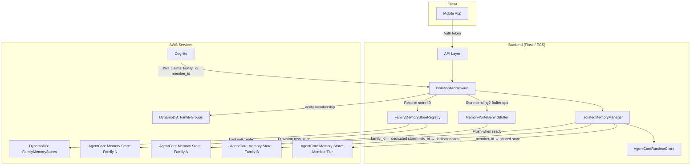
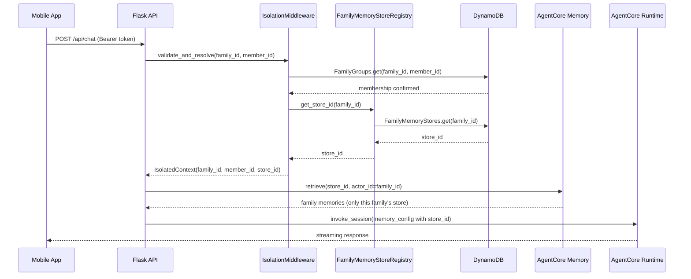
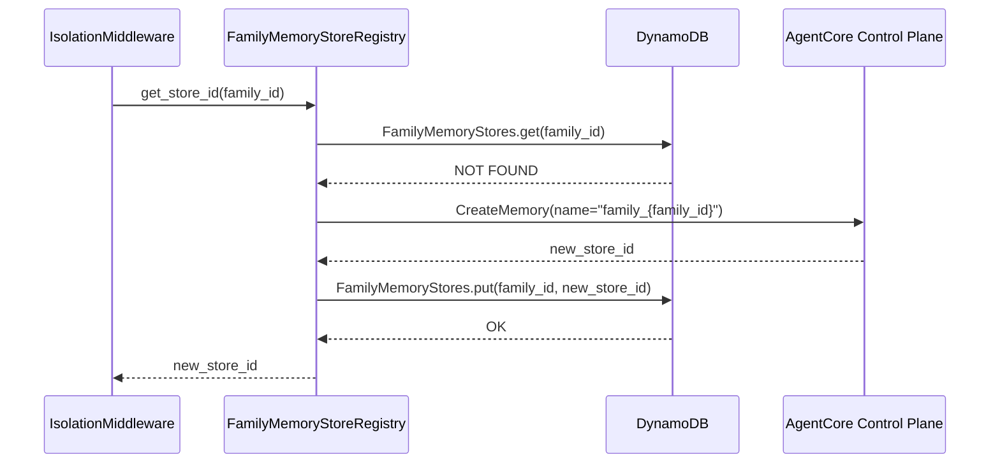
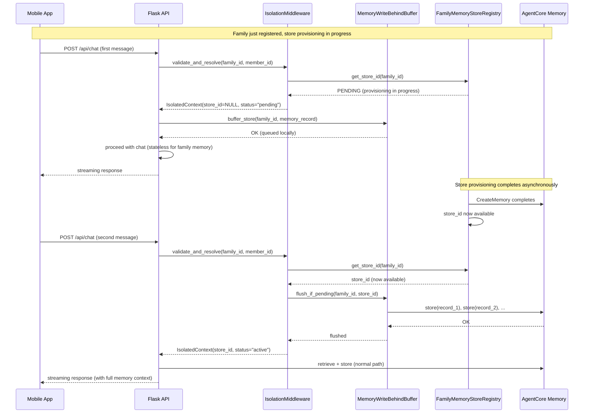

# Design Document: Multi-Family Memory Isolation

## Overview

HomeAgent currently uses two global AgentCore Memory stores (one for family memory, one for member memory) shared across all families. Isolation between families relies entirely on application-level filtering by `family_id` as the `actor_id`. This design is fragile — a bug in filtering logic, a misrouted request, or a missing validation could leak one family's private memories (health records, preferences, conversation context) to another family.

This design introduces infrastructure-enforced memory isolation so that cross-family data leakage is architecturally impossible, not just unlikely. The approach provisions per-family AgentCore Memory stores, enforces family membership at the middleware layer before any memory operation, and adds a DynamoDB-backed registry to map families to their dedicated store IDs. The result is defense-in-depth: even if application-level filtering fails, the underlying memory store physically cannot return another family's data.

The design leverages Amazon Bedrock AgentCore Memory for per-family store provisioning, DynamoDB for the family-to-store registry, Cognito for identity, and CDK for infrastructure-as-code.

## Architecture



## Sequence Diagrams

### Chat Request with Isolated Memory



### First Request for a New Family (Store Provisioning)



## Components and Interfaces

### Component 1: IsolationMiddleware

**Purpose**: Intercepts every request that touches family memory. Verifies the requesting member belongs to the target family and resolves the family's dedicated memory store ID. Blocks access before any memory operation if membership is invalid.

```pascal
STRUCTURE IsolatedContext
  family_id: String
  member_id: String
  family_store_id: String
  is_verified: Boolean
END STRUCTURE
```

**Responsibilities**:
- Extract family_id and member_id from authenticated request context (Cognito JWT claims)
- Verify family membership via FamilyGroups DynamoDB table
- Resolve the family's dedicated AgentCore Memory store ID via FamilyMemoryStoreRegistry
- Attach IsolatedContext to the request for downstream use
- Reject requests with 403 if membership verification fails

### Component 2: FamilyMemoryStoreRegistry

**Purpose**: Maps each family_id to a dedicated AgentCore Memory store ID. Provisions new stores on-demand when a family is first encountered. Caches store IDs to avoid repeated DynamoDB lookups.

```pascal
STRUCTURE StoreRegistryEntry
  family_id: String        -- partition key
  store_id: String         -- AgentCore Memory store ID
  store_name: String       -- "family_{family_id}"
  created_at: String       -- ISO 8601 timestamp
  status: String           -- "active" | "migrating" | "decommissioned"
END STRUCTURE
```

**Responsibilities**:
- Lookup store_id for a family_id from DynamoDB (FamilyMemoryStores table)
- Provision a new AgentCore Memory store via the control plane API if none exists
- Cache store_id mappings in-memory with TTL (5 minutes)
- Handle provisioning failures with retry and circuit breaker

### Component 3: IsolatedMemoryManager

**Purpose**: Replaces the current AgentCoreMemoryManager. Instead of using global store IDs, it accepts a per-family store_id from the IsolatedContext and builds MemoryConfig objects scoped to that specific store.

```pascal
STRUCTURE IsolatedMemoryConfig
  family_store_id: String   -- per-family store
  member_store_id: String   -- shared member store (unchanged)
  family_id: String
  member_id: String
  session_id: String
END STRUCTURE
```

**Responsibilities**:
- Build MemoryConfig using the family's dedicated store_id (not a global one)
- Member memory tier remains shared (scoped by member_id as actor_id — no cross-family risk)
- Validate that the store_id matches the family_id before any operation
- Provide the same safe_* wrapper pattern for error handling and retry

### Component 4: FamilyMemoryStores DynamoDB Table

**Purpose**: Persistent registry mapping family_id to AgentCore Memory store IDs.

**Key Schema**: PK = `family_id` (String)

**Attributes**:
- `store_id` (String) — AgentCore Memory store ID
- `store_name` (String) — human-readable name
- `created_at` (String) — ISO 8601
- `status` (String) — lifecycle state

### Component 5: Migration Orchestrator

**Purpose**: One-time migration tool that reads existing family memory records from the shared global store, provisions per-family stores, and copies records into the correct isolated store.

**Responsibilities**:
- Enumerate all distinct family_ids from the existing shared store
- Provision a dedicated store for each family
- Copy records from the shared store to the per-family store
- Verify record counts match after migration
- Support dry-run mode for validation before execution

## Data Models

### FamilyMemoryStores Table

```pascal
STRUCTURE FamilyMemoryStoresItem
  family_id: String          -- PK, the family identifier
  store_id: String           -- AgentCore Memory store ID
  store_name: String         -- "family_{family_id}"
  created_at: String         -- ISO 8601
  updated_at: String         -- ISO 8601
  status: String             -- "active" | "migrating" | "decommissioned"
  event_expiry_days: Integer -- default 365
END STRUCTURE
```

**Validation Rules**:
- family_id must be non-empty
- store_id must be non-empty and match AgentCore Memory ID format
- status must be one of: "active", "migrating", "decommissioned"
- event_expiry_days must be positive integer

### IsolatedContext (Request-Scoped)

```pascal
STRUCTURE IsolatedContext
  family_id: String
  member_id: String
  family_store_id: String | NULL  -- NULL when store_status is "pending"
  is_verified: Boolean
  store_status: String            -- "active" | "pending"
  verified_at: String             -- ISO 8601
END STRUCTURE
```

**Validation Rules**:
- family_id and member_id must be non-empty when is_verified is True
- When store_status is "active": family_store_id must be non-empty and reference an active store
- When store_status is "pending": family_store_id is NULL (write-behind buffer handles operations)
- verified_at must be a valid ISO 8601 timestamp


## Algorithmic Pseudocode

### Store Resolution Algorithm

```pascal
ALGORITHM resolve_family_store(family_id, member_id)
INPUT: family_id of type String, member_id of type String
OUTPUT: IsolatedContext

BEGIN
  -- Precondition: family_id and member_id are non-empty strings
  ASSERT family_id IS NOT EMPTY
  ASSERT member_id IS NOT EMPTY

  -- Step 1: Verify family membership
  membership ← FamilyGroups.get_item(family_id, member_id)
  IF membership IS NULL THEN
    RAISE AccessDeniedError("Member does not belong to family")
  END IF

  -- Step 2: Resolve store ID (cache-first)
  store_id ← cache.get(family_id)
  IF store_id IS NULL THEN
    -- Cache miss: lookup in DynamoDB
    entry ← FamilyMemoryStores.get_item(family_id)
    IF entry IS NOT NULL AND entry.status = "active" THEN
      store_id ← entry.store_id
      cache.set(family_id, store_id, ttl=300)
    ELSE
      -- First request for this family: provision new store
      store_id ← provision_family_store(family_id)
    END IF
  END IF

  -- Postcondition: store_id is non-empty and maps to an active store
  ASSERT store_id IS NOT EMPTY

  RETURN IsolatedContext(
    family_id=family_id,
    member_id=member_id,
    family_store_id=store_id,
    is_verified=TRUE,
    verified_at=NOW()
  )
END
```

**Preconditions:**
- family_id is a valid, non-empty family identifier
- member_id is a valid, non-empty member identifier
- FamilyGroups table is accessible
- FamilyMemoryStores table is accessible

**Postconditions:**
- Returns IsolatedContext with is_verified = TRUE
- family_store_id references an active, dedicated AgentCore Memory store
- If member is not in family, AccessDeniedError is raised (no context returned)

**Loop Invariants:** N/A (no loops)

### Store Provisioning Algorithm

```pascal
ALGORITHM provision_family_store(family_id)
INPUT: family_id of type String
OUTPUT: store_id of type String

BEGIN
  ASSERT family_id IS NOT EMPTY

  store_name ← "family_" + family_id
  
  -- Step 1: Create AgentCore Memory store via control plane
  TRY
    response ← agentcore_control.CreateMemory(
      name=store_name,
      description="Isolated family memory for " + family_id,
      event_expiry_duration=365
    )
    store_id ← response.memory_id
  CATCH ProvisioningError AS e
    LOG_ERROR("Failed to provision store for family " + family_id, e)
    RAISE MemoryStoreProvisioningError(family_id, e)
  END TRY

  -- Step 2: Register in DynamoDB
  entry ← FamilyMemoryStoresItem(
    family_id=family_id,
    store_id=store_id,
    store_name=store_name,
    created_at=NOW(),
    updated_at=NOW(),
    status="active",
    event_expiry_days=365
  )
  FamilyMemoryStores.put_item(entry, condition="attribute_not_exists(family_id)")

  -- Step 3: Update cache
  cache.set(family_id, store_id, ttl=300)

  -- Postcondition: store_id is valid and registered
  ASSERT store_id IS NOT EMPTY
  RETURN store_id
END
```

**Preconditions:**
- family_id is valid and has no existing active store
- AgentCore control plane is accessible
- IAM permissions include bedrock-agentcore:CreateMemory

**Postconditions:**
- A new AgentCore Memory store exists dedicated to this family
- FamilyMemoryStores table contains the mapping
- Cache is populated with the new store_id

**Loop Invariants:** N/A

### Isolated Memory Retrieval Algorithm

```pascal
ALGORITHM retrieve_isolated_family_memory(context)
INPUT: context of type IsolatedContext
OUTPUT: list of FamilyMemoryRecord

BEGIN
  ASSERT context.is_verified = TRUE
  ASSERT context.family_store_id IS NOT EMPTY

  -- Build memory config using the family's dedicated store
  config ← MemoryConfig(
    memory_id=context.family_store_id,
    session_id=context.session_id,
    actor_id=context.family_id,
    retrieval_namespaces=[
      "/family/{actorId}/health",
      "/family/{actorId}/preferences"
    ]
  )

  -- Retrieve from the dedicated store
  -- Even if actor_id filtering fails, the store only contains
  -- this family's data — cross-family leakage is impossible
  records ← agentcore_memory.retrieve(config)

  RETURN records
END
```

**Preconditions:**
- context.is_verified is TRUE (membership already verified)
- context.family_store_id references an active store belonging to this family

**Postconditions:**
- Returns only records belonging to context.family_id
- No records from other families can be returned (store-level isolation)

**Loop Invariants:** N/A

### Migration Algorithm

```pascal
ALGORITHM migrate_shared_to_isolated(dry_run)
INPUT: dry_run of type Boolean
OUTPUT: MigrationReport

BEGIN
  report ← MigrationReport(migrated=0, failed=0, skipped=0)

  -- Step 1: Enumerate all distinct family_ids from shared store
  all_records ← shared_store.scan_all()
  family_ids ← UNIQUE(record.family_id FOR EACH record IN all_records)

  -- Step 2: Process each family
  FOR EACH fid IN family_ids DO
    -- Loop invariant: all previously processed families have
    -- dedicated stores with correct record counts
    ASSERT report.migrated + report.failed + report.skipped = index_of(fid)

    -- Check if already migrated
    existing ← FamilyMemoryStores.get_item(fid)
    IF existing IS NOT NULL AND existing.status = "active" THEN
      report.skipped ← report.skipped + 1
      CONTINUE
    END IF

    family_records ← FILTER(all_records, record.family_id = fid)

    IF dry_run THEN
      LOG_INFO("DRY RUN: Would migrate " + LENGTH(family_records) + " records for " + fid)
      report.migrated ← report.migrated + 1
      CONTINUE
    END IF

    TRY
      -- Provision dedicated store
      store_id ← provision_family_store(fid)

      -- Copy records to dedicated store
      FOR EACH record IN family_records DO
        agentcore_memory.store(store_id, record)
      END FOR

      -- Verify record count
      migrated_records ← agentcore_memory.retrieve_all(store_id, fid)
      ASSERT LENGTH(migrated_records) = LENGTH(family_records)

      report.migrated ← report.migrated + 1
    CATCH error
      LOG_ERROR("Migration failed for family " + fid, error)
      report.failed ← report.failed + 1
    END TRY
  END FOR

  RETURN report
END
```

**Preconditions:**
- Shared global store is accessible and contains existing records
- AgentCore control plane is accessible for provisioning
- Sufficient IAM permissions for CreateMemory and memory read/write

**Postconditions:**
- Each family has a dedicated store with all its records copied
- No data loss: migrated record count matches source count per family
- Migration report accurately reflects outcomes

**Loop Invariants:**
- All previously processed families have dedicated stores with verified record counts
- report.migrated + report.failed + report.skipped equals the number of families processed so far

### Write-Behind Buffer Algorithm

```pascal
ALGORITHM buffer_or_execute(family_id, operation, payload)
INPUT: family_id (String), operation (String), payload (Dict)
OUTPUT: result or BufferAcknowledgement

BEGIN
  ASSERT family_id IS NOT EMPTY

  -- Step 1: Check if store is available
  store_status ← registry.get_store_status(family_id)

  IF store_status.is_active THEN
    -- Store is ready: check if there are buffered ops to flush first
    IF buffer.has_pending(family_id) THEN
      buffer.flush(family_id, store_status.store_id)
    END IF
    -- Execute directly
    RETURN execute_operation(store_status.store_id, operation, payload)
  END IF

  -- Step 2: Store not ready — buffer the operation
  buffered_op ← BufferedMemoryOperation(
    operation_type=operation,
    family_id=family_id,
    payload=payload,
    queued_at=NOW(),
    attempt_count=0
  )
  buffer.enqueue(family_id, buffered_op)

  -- Step 3: If this is a retrieve, return buffered records
  IF operation = "retrieve" THEN
    RETURN buffer.get_buffered_records(family_id, payload.filters)
  END IF

  RETURN BufferAcknowledgement(queued=TRUE, position=buffer.size(family_id))
END
```

**Preconditions:**
- family_id is valid and membership is already verified
- Registry is accessible (may return "pending" status)

**Postconditions:**
- If store is active: operation is executed directly (after flushing any pending buffer)
- If store is pending: operation is queued and acknowledged
- No operations are lost — they are either executed or buffered

```pascal
ALGORITHM flush_buffer(family_id, store_id)
INPUT: family_id (String), store_id (String)
OUTPUT: FlushResult

BEGIN
  ASSERT family_id IS NOT EMPTY
  ASSERT store_id IS NOT EMPTY

  state ← buffer.get_state(family_id)
  IF state IS NULL OR state.status = "flushed" THEN
    RETURN FlushResult(flushed=0, failed=0)
  END IF

  state.status ← "flushing"
  flushed ← 0
  failed ← 0

  -- Flush in FIFO order
  FOR EACH op IN state.operations DO
    -- Loop invariant: all previously processed ops are either
    -- successfully flushed or marked as failed
    TRY
      execute_operation(store_id, op.operation_type, op.payload)
      flushed ← flushed + 1
    CATCH error
      op.attempt_count ← op.attempt_count + 1
      IF op.attempt_count >= 3 THEN
        LOG_ERROR("Permanent flush failure for " + family_id, op, error)
        failed ← failed + 1
      ELSE
        -- Keep in buffer for next attempt
        failed ← failed + 1
      END IF
    END TRY
  END FOR

  -- Remove successfully flushed ops
  state.operations ← FILTER(state.operations, op.attempt_count < 3 AND NOT flushed)
  IF LENGTH(state.operations) = 0 THEN
    state.status ← "flushed"
    state.flushed_at ← NOW()
    state.store_id ← store_id
    -- Free memory after successful flush
    buffer.remove_state(family_id)
  END IF

  RETURN FlushResult(flushed=flushed, failed=failed)
END
```

**Preconditions:**
- store_id references an active, provisioned AgentCore Memory store
- Buffer state exists for family_id

**Postconditions:**
- All buffered operations are attempted in FIFO order
- Successfully flushed operations are removed from the buffer
- Failed operations (< 3 attempts) remain for retry
- Operations with 3+ failures are logged and discarded
- Buffer state is cleaned up after full flush

**Loop Invariants:**
- flushed + failed equals the number of operations processed so far
- Operations are processed in the order they were queued

### Updated Store Resolution Algorithm (with Buffer Support)

```pascal
ALGORITHM resolve_family_store_v2(family_id, member_id)
INPUT: family_id (String), member_id (String)
OUTPUT: IsolatedContext

BEGIN
  ASSERT family_id IS NOT EMPTY
  ASSERT member_id IS NOT EMPTY

  -- Step 1: Verify family membership (unchanged)
  membership ← FamilyGroups.get_item(family_id, member_id)
  IF membership IS NULL THEN
    RAISE AccessDeniedError("Member does not belong to family")
  END IF

  -- Step 2: Resolve store ID (cache-first)
  store_id ← cache.get(family_id)
  IF store_id IS NULL THEN
    entry ← FamilyMemoryStores.get_item(family_id)
    IF entry IS NOT NULL AND entry.status = "active" THEN
      store_id ← entry.store_id
      cache.set(family_id, store_id, ttl=300)
    ELSE IF entry IS NOT NULL AND entry.status = "provisioning" THEN
      -- Store is being provisioned — return pending context
      RETURN IsolatedContext(
        family_id=family_id,
        member_id=member_id,
        family_store_id=NULL,
        is_verified=TRUE,
        store_status="pending",
        verified_at=NOW()
      )
    ELSE
      -- No entry at all: kick off async provisioning
      start_async_provisioning(family_id)
      RETURN IsolatedContext(
        family_id=family_id,
        member_id=member_id,
        family_store_id=NULL,
        is_verified=TRUE,
        store_status="pending",
        verified_at=NOW()
      )
    END IF
  END IF

  -- Step 3: Store is active — flush any pending buffer
  IF buffer.has_pending(family_id) THEN
    flush_buffer(family_id, store_id)
  END IF

  RETURN IsolatedContext(
    family_id=family_id,
    member_id=member_id,
    family_store_id=store_id,
    is_verified=TRUE,
    store_status="active",
    verified_at=NOW()
  )
END
```

## Key Functions with Formal Specifications

### Function 1: validate_and_resolve()

```pascal
PROCEDURE validate_and_resolve(family_id, member_id)
  INPUT: family_id (String), member_id (String)
  OUTPUT: IsolatedContext
  RAISES: AccessDeniedError, MemoryStoreProvisioningError
```

**Preconditions:**
- family_id is a non-empty string
- member_id is a non-empty string
- Request is authenticated (Cognito token validated)

**Postconditions:**
- Returns IsolatedContext with is_verified = TRUE
- family_store_id references a dedicated, active AgentCore Memory store
- If member is not in family, raises AccessDeniedError (no partial context)

**Loop Invariants:** N/A

### Function 2: get_store_id()

```pascal
PROCEDURE get_store_id(family_id)
  INPUT: family_id (String)
  OUTPUT: store_id (String)
  RAISES: MemoryStoreProvisioningError
```

**Preconditions:**
- family_id is a non-empty string
- FamilyMemoryStores table is accessible

**Postconditions:**
- Returns a valid AgentCore Memory store ID
- If no store exists, one is provisioned and registered
- Cache is populated after resolution

**Loop Invariants:** N/A

### Function 3: build_isolated_memory_config()

```pascal
PROCEDURE build_isolated_memory_config(context, session_id)
  INPUT: context (IsolatedContext), session_id (String)
  OUTPUT: CombinedSessionManager
```

**Preconditions:**
- context.is_verified = TRUE
- context.family_store_id is non-empty
- session_id is non-empty

**Postconditions:**
- Returns CombinedSessionManager with family_config.memory_id = context.family_store_id
- Member config uses the shared member store (unchanged)
- family_config.actor_id = context.family_id

**Loop Invariants:** N/A

### Function 4: provision_family_store()

```pascal
PROCEDURE provision_family_store(family_id)
  INPUT: family_id (String)
  OUTPUT: store_id (String)
  RAISES: MemoryStoreProvisioningError
```

**Preconditions:**
- family_id has no existing active store in FamilyMemoryStores
- AgentCore control plane is accessible
- IAM role has bedrock-agentcore:CreateMemory permission

**Postconditions:**
- A new AgentCore Memory store exists with name "family_{family_id}"
- FamilyMemoryStores table contains the (family_id → store_id) mapping
- Store status is "active"

**Loop Invariants:** N/A

## Example Usage

```pascal
-- Example 1: Chat request with isolated memory
SEQUENCE
  -- Middleware intercepts the request
  context ← validate_and_resolve("family_abc", "member_123")
  -- context.family_store_id = "store-xyz-dedicated-to-family-abc"
  -- context.is_verified = TRUE

  -- Build memory config using dedicated store
  combined ← build_isolated_memory_config(context, "session_456")
  -- combined.family_config.memory_id = "store-xyz-dedicated-to-family-abc"
  -- NOT the global AGENTCORE_FAMILY_MEMORY_ID

  -- Even if actor_id filtering has a bug, the store only contains
  -- family_abc's data — family_def's data is in a different store
END SEQUENCE

-- Example 2: Cross-family access attempt (blocked)
SEQUENCE
  TRY
    context ← validate_and_resolve("family_abc", "member_from_family_def")
    -- This RAISES AccessDeniedError because member is not in family_abc
  CATCH AccessDeniedError
    RETURN HTTP 403 "Access denied: not a member of this family"
  END TRY
END SEQUENCE

-- Example 3: First request for a new family (auto-provisioning)
SEQUENCE
  context ← validate_and_resolve("family_new", "member_first")
  -- Registry finds no store for family_new
  -- Provisions new AgentCore Memory store via control plane
  -- Registers store_id in DynamoDB
  -- Returns context with the new store_id
  -- Subsequent requests for family_new hit the cache
END SEQUENCE
```

## Correctness Properties

*A property is a characteristic or behavior that should hold true across all valid executions of a system — essentially, a formal statement about what the system should do. Properties serve as the bridge between human-readable specifications and machine-verifiable correctness guarantees.*

### Property 1: Store Isolation Guarantee

*For any* two distinct family_id values family_a and family_b, calling get_store_id on each should return different store_id values. No two families ever share a memory store.

**Validates: Requirement 2.7**

### Property 2: Membership Gate

*For any* family_id and member_id where the member does not belong to the family, calling validate_and_resolve should raise an AccessDeniedError. Non-members can never obtain an IsolatedContext.

**Validates: Requirements 1.2, 1.4**

### Property 3: Store-Data Affinity

*For any* family_id and any record returned by retrieve_isolated_family_memory, the record's store origin should match the family's dedicated store_id from the IsolatedContext, and that store_id should equal get_store_id(family_id).

**Validates: Requirements 3.4, 3.5**

### Property 4: Idempotent Provisioning

*For any* family_id, calling get_store_id multiple times should always return the same store_id. Provisioning is idempotent — concurrent or repeated calls never create duplicate stores.

**Validates: Requirements 2.4, 2.6**

### Property 5: Migration Completeness

*For any* family_id in the set of migrated families, the number of records in the family's dedicated store should equal the number of records for that family_id in the original shared store.

**Validates: Requirements 5.2, 5.3**

### Property 6: Cache Consistency

*For any* family_id where the cache contains an entry, the cached store_id should match the store_id in the FamilyMemoryStores_Table. After provisioning a new store, the cache should immediately reflect the new mapping.

**Validates: Requirements 9.1, 9.3, 2.3**

### Property 7: Write-Behind Completeness

*For any* family_id with buffered operations, once the family's store becomes active and flush_buffer completes successfully, the buffer should be empty and all previously buffered records should exist in the dedicated store.

**Validates: Requirements 6.3, 6.6, 6.7**

### Property 8: Buffer Ordering Preservation

*For any* family_id and any two buffered operations op_i and op_j where op_i was queued before op_j, op_i should be flushed to the store before op_j. FIFO order is strictly preserved.

**Validates: Requirement 6.1**

### Property 9: Pending Context Chat Availability

*For any* verified family member (member_id in FamilyGroups for family_id), validate_and_resolve should return an IsolatedContext regardless of whether the store_status is "active" or "pending". Chat is never blocked by store provisioning.

**Validates: Requirements 8.1, 8.4**

### Property 10: Isolated Config Construction

*For any* IsolatedContext with an active store, the IsolatedMemoryManager should build a MemoryConfig where family memory_id equals the context's family_store_id (not the global store), actor_id equals the family_id, and member-tier memory continues using the shared member store.

**Validates: Requirements 3.1, 3.2, 3.3**

### Property 11: Migration Report Consistency

*For any* migration run, the MigrationReport's migrated + failed + skipped counts should equal the total number of distinct family_id values in the shared store.

**Validates: Requirements 5.5, 5.8**

### Property 12: Registry Entry Validation

*For any* FamilyMemoryStoresItem written to the table, family_id and store_id must be non-empty strings, and status must be one of "active", "migrating", "provisioning", or "decommissioned".

**Validates: Requirements 4.3, 4.4**

### Component 6: MemoryWriteBehindBuffer

**Purpose**: Server-side write-behind cache that allows chat to proceed immediately after family registration, even before the per-family AgentCore Memory store is provisioned. Memory operations are queued in-memory and flushed to the dedicated store once provisioning completes. This eliminates any blocking wait during the registration-to-first-chat path.

```pascal
STRUCTURE BufferedMemoryOperation
  operation_type: String     -- "store_family" | "store_member"
  family_id: String
  payload: Dict              -- operation-specific arguments
  queued_at: String          -- ISO 8601 timestamp
  attempt_count: Integer     -- number of flush attempts
END STRUCTURE

STRUCTURE BufferState
  family_id: String
  status: String             -- "buffering" | "flushing" | "flushed"
  operations: List[BufferedMemoryOperation]
  store_id: String | NULL    -- NULL while provisioning, set once ready
  created_at: String
  flushed_at: String | NULL
END STRUCTURE
```

**Responsibilities**:
- Accept memory store/retrieve operations when the family's store is not yet provisioned
- Queue write operations in-memory with ordering preserved (FIFO)
- For retrieve operations during buffering: return buffered records that match the query (local read)
- Monitor store provisioning status via the FamilyMemoryStoreRegistry
- Once the store becomes available, flush all buffered operations in order
- After flush completes, switch to direct pass-through mode (no more buffering)
- Handle flush failures with retry (max 3 attempts per operation)
- Discard buffer state after successful flush to free memory

### Sequence Diagram: Write-Behind Buffer Flow



## Error Handling

### Error Scenario 1: Family Membership Verification Failure

**Condition**: Member ID not found in FamilyGroups table for the given family_id
**Response**: Return HTTP 403 with message "Access denied: not a member of this family"
**Recovery**: No recovery needed — this is an authorization failure. Log the attempt for audit.

### Error Scenario 2: Store Provisioning Failure

**Condition**: AgentCore CreateMemory API call fails (rate limit, service error, IAM issue)
**Response**: Return HTTP 503 with message "Memory service temporarily unavailable"
**Recovery**: Retry with exponential backoff (max 3 attempts). If all retries fail, the request proceeds without family memory (stateless mode) and the provisioning is retried on the next request.

### Error Scenario 3: DynamoDB Registry Lookup Failure

**Condition**: FamilyMemoryStores table is unreachable or throttled
**Response**: If cache has a valid entry, use it. Otherwise return HTTP 503.
**Recovery**: DynamoDB auto-retries with SDK. Cache serves as fallback for transient failures.

### Error Scenario 4: Conditional Write Conflict (Race Condition)

**Condition**: Two concurrent requests for a new family both try to provision a store
**Response**: The DynamoDB conditional put (`attribute_not_exists(family_id)`) ensures only one succeeds. The loser catches the ConditionalCheckFailedException, re-reads the table, and uses the store_id written by the winner.
**Recovery**: Automatic — no data corruption possible due to conditional write.

### Error Scenario 5: Migration Record Mismatch

**Condition**: After copying records, the target store count doesn't match source count
**Response**: Mark the family's store status as "migrating" (not "active"). Log the discrepancy.
**Recovery**: Re-run migration for the affected family. The migration is idempotent — re-copying is safe.

### Error Scenario 6: Write-Behind Buffer Flush Failure

**Condition**: One or more buffered operations fail during flush (e.g., AgentCore API error, throttling)
**Response**: Failed operations remain in the buffer with incremented attempt_count. Successfully flushed operations are removed.
**Recovery**: Next request for this family triggers another flush attempt. Operations that fail 3 times are logged as permanent failures and discarded. The family's chat continues to work — only the specific failed memory records are lost, and they are logged for manual recovery.

### Error Scenario 7: Buffer Memory Pressure

**Condition**: A family accumulates many buffered operations before the store is provisioned (e.g., rapid chat during slow provisioning)
**Response**: Buffer enforces a max of 100 operations per family. If exceeded, oldest operations are evicted with a warning log.
**Recovery**: Evicted operations are logged with full payload for manual recovery. This is a safety valve — normal provisioning completes in 1-2 seconds, so hitting 100 buffered ops indicates an infrastructure issue.

## Testing Strategy

### Unit Testing Approach

- Test IsolationMiddleware with mocked DynamoDB and registry
- Test FamilyMemoryStoreRegistry with mocked AgentCore control plane
- Test IsolatedMemoryManager builds correct MemoryConfig with per-family store_id
- Test cache hit/miss/expiry behavior
- Test conditional write conflict handling
- Coverage goal: 90%+ for all isolation components

### Property-Based Testing Approach

**Property Test Library**: Hypothesis (Python)

- Generate random family_id/member_id pairs and verify store isolation guarantee
- Generate random membership configurations and verify the membership gate property
- Generate concurrent provisioning scenarios and verify idempotent provisioning
- Generate migration datasets and verify migration completeness

### Integration Testing Approach

- End-to-end test: create two families, store memories for each, verify cross-family retrieval returns empty
- Provisioning test: first request for a new family triggers store creation and subsequent requests use cache
- Migration test: populate shared store, run migration, verify per-family stores have correct data
- Failure mode test: simulate AgentCore API failure, verify graceful degradation to stateless mode

## Performance Considerations

- **Cache TTL**: 5-minute TTL on store_id cache avoids DynamoDB lookups on every request. For a family with active members, the store_id is resolved from cache ~99% of the time.
- **Provisioning latency**: First request for a new family incurs ~1-2s overhead for AgentCore CreateMemory. Subsequent requests are sub-millisecond (cache hit).
- **DynamoDB**: FamilyMemoryStores table uses on-demand billing. Single-item get by PK is <10ms at any scale.
- **Store count scaling**: AgentCore Memory supports many stores per account. For HomeAgent's expected scale (hundreds to low thousands of families), per-family stores are well within limits.
- **Migration**: Batch migration can be parallelized per-family. Each family's migration is independent.

## Security Considerations

- **Defense in depth**: Even if application-level actor_id filtering has a bug, the per-family store physically cannot return another family's data.
- **Membership verification**: Every request is verified against FamilyGroups before any memory operation. This is not bypassable by the application layer.
- **IAM scoping**: The backend's IAM role has access to all family stores (necessary for multi-tenant operation). The isolation boundary is at the application middleware layer, backed by DynamoDB membership records.
- **Audit logging**: All membership verification failures are logged with family_id, member_id, and timestamp for security audit.
- **Store lifecycle**: Decommissioned stores are marked in the registry but not immediately deleted, allowing audit and recovery.
- **Cognito integration**: family_id and member_id are extracted from Cognito JWT claims, not from request parameters. This prevents client-side tampering.

## Dependencies

- **Amazon Bedrock AgentCore Memory** — per-family store provisioning via CreateMemory API
- **Amazon Bedrock AgentCore Control Plane** — store lifecycle management
- **Amazon DynamoDB** — FamilyMemoryStores registry table, FamilyGroups membership table
- **Amazon Cognito** — JWT claims for family_id and member_id
- **AWS CDK (Python)** — infrastructure-as-code for new DynamoDB table and IAM permissions
- **boto3** — AWS SDK for Python (AgentCore and DynamoDB operations)
- **Hypothesis** — property-based testing library
