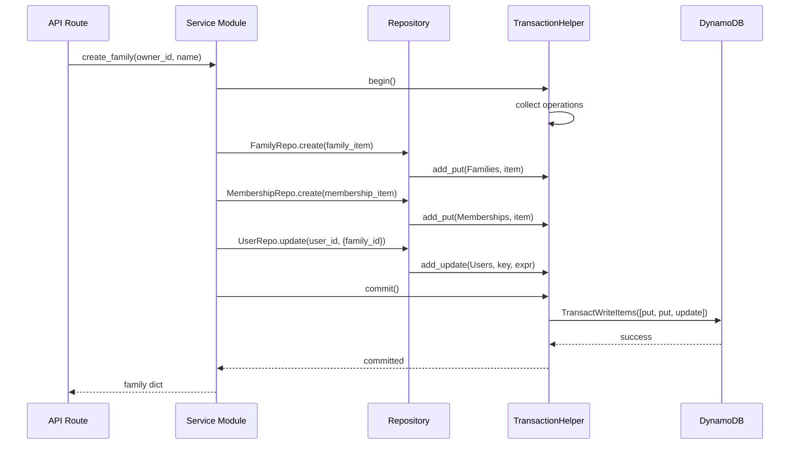
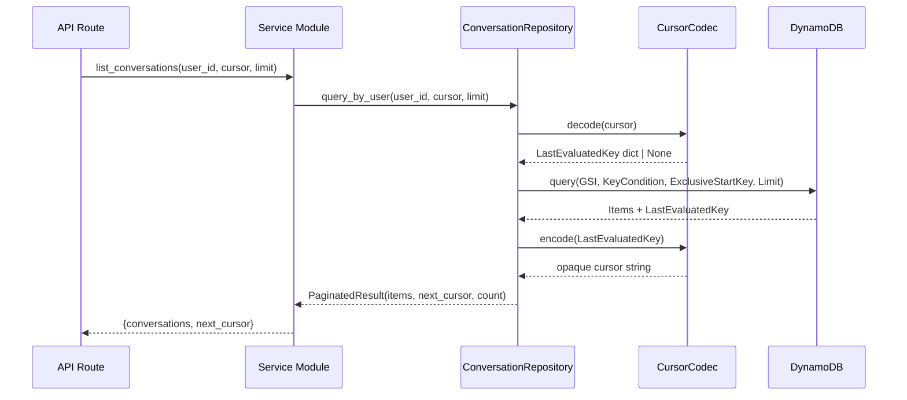
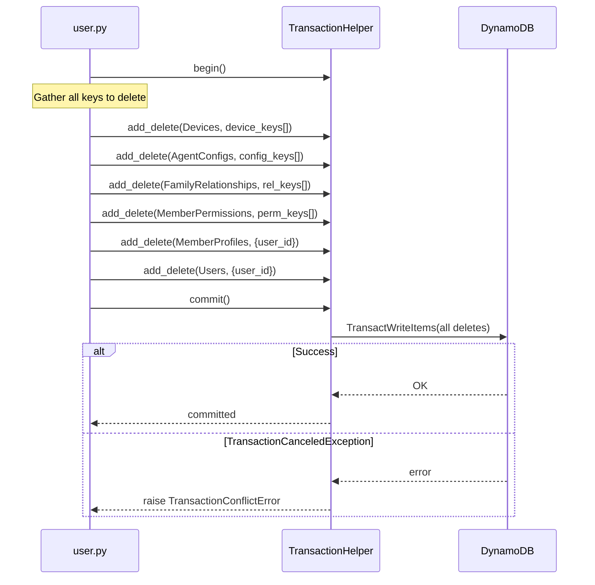

# Design Document: Unified Data Access Layer

## Overview

HomeAgent's 22 DynamoDB tables are accessed via raw `get_table()` calls scattered across 15+ service modules. Each service constructs its own `KeyConditionExpression`, `UpdateExpression`, error handling, and pagination logic. A partial `StorageProvider` abstraction covers only 4 health-related tables, creating a dual code path. Six operations use full table scans, two services have N+1 query patterns, and the `delete_member()` cascade spans 8 tables without atomicity.

This design introduces a unified Data Access Layer (DAL) in `backend/app/dal/` that provides:

1. A `BaseRepository` abstract class with typed CRUD, query, and batch operations
2. Concrete repository implementations for all 22 entities
3. A `TransactionHelper` wrapping DynamoDB `TransactWriteItems`
4. A `PaginatedResult` type with opaque cursor encoding
5. A database-agnostic exception hierarchy
6. New GSIs to eliminate all 6 table scans and N+1 patterns
7. Table consolidation (FamilyMembers + FamilyGroups → single Memberships table)
8. In-memory repository for unit testing

The DAL keeps DynamoDB as the sole database. The evaluation confirmed ~80% of access patterns are key-value lookups or single-partition queries. On-demand pricing is cheaper than Aurora Serverless v2 minimum (~$43/month idle). The Messages table's write-heavy pattern with TTL auto-cleanup is a DynamoDB strength. Aurora would add connection pooling, schema migrations, and VPC networking complexity without meaningful gains.

## Architecture

```mermaid
graph TD
    subgraph Service_Layer["Service Layer (backend/app/services/)"]
        S1[user.py]
        S2[family.py]
        S3[conversation.py]
        S4[health_records.py]
        S5[profile.py]
        S6[family_tree.py]
        SN[...other services]
    end

    subgraph DAL["DAL (backend/app/dal/)"]
        BR[BaseRepository]
        TX[TransactionHelper]
        PG[PaginatedResult / CursorCodec]
        EX[Exception Hierarchy]
        IM[InMemoryRepository]

        subgraph Repositories
            UR[UserRepository]
            FR[FamilyRepository]
            MR[MembershipRepository]
            CR[ConversationRepository]
            MsgR[MessageRepository]
            PR[ProfileRepository]
            HR[HealthRecordRepository]
            ICR[InviteCodeRepository]
            RR[...other repos]
        end
    end

    subgraph DynamoDB["DynamoDB Tables"]
        T1[Users]
        T2[Families]
        T3[Memberships]
        T4[Conversations]
        T5[Messages]
        T6[MemberProfiles]
        T7[HealthRecords]
        TN[...other tables]
    end

    S1 --> UR
    S2 --> FR
    S2 --> MR
    S3 --> CR
    S3 --> MsgR
    S4 --> HR
    S5 --> PR
    S6 --> BR

    UR --> BR
    FR --> BR
    MR --> BR
    CR --> BR
    MsgR --> BR
    PR --> BR
    HR --> BR

    BR --> TX
    BR --> PG
    BR --> EX

    UR --> T1
    FR --> T2
    MR --> T3
    CR --> T4
    MsgR --> T5
    PR --> T6
    HR --> T7
```



## Sequence Diagrams

### Service Call Through DAL



### Paginated Query Through DAL



### Delete Member Cascade (Atomic)



## Components and Interfaces

### Component 1: BaseRepository

**Purpose**: Abstract base class defining the contract for all entity repositories. Encapsulates DynamoDB-specific logic (expressions, pagination, error translation) so service code never touches boto3 directly.

```pascal
STRUCTURE RepositoryConfig
  table_name: String
  partition_key: String
  sort_key: String | NULL
  gsi_definitions: List[GSIConfig]
  entity_class: Type[DataClass]
END STRUCTURE

STRUCTURE GSIConfig
  index_name: String
  partition_key: String
  sort_key: String | NULL
END STRUCTURE
```

**Responsibilities**:
- Provide typed `create`, `get_by_id`, `query`, `update`, `delete`, `batch_get`, `batch_delete` methods
- Construct all DynamoDB expressions internally
- Translate boto3 exceptions to DAL exceptions
- Return `PaginatedResult` for all list/query operations
- Emit structured timing logs for each operation
- Accept injected DynamoDB resource for testability

### Component 2: TransactionHelper

**Purpose**: Wraps DynamoDB `TransactWriteItems` to provide atomic multi-table operations. Collects put, update, and delete operations, then commits them in a single transaction (up to 100 items per DynamoDB limit).

```pascal
STRUCTURE TransactionOperation
  operation_type: String    -- "put" | "update" | "delete" | "condition_check"
  table_name: String
  item: Dict | NULL         -- for put
  key: Dict | NULL          -- for update/delete
  expression: String | NULL -- for update/condition_check
END STRUCTURE
```

**Responsibilities**:
- Collect operations via `add_put()`, `add_update()`, `add_delete()`, `add_condition_check()`
- Validate operation count does not exceed 100 (DynamoDB limit)
- Execute `TransactWriteItems` on `commit()`
- Translate `TransactionCanceledException` to `TransactionConflictError`
- Support context manager protocol (`with TransactionHelper() as tx:`)

### Component 3: CursorCodec

**Purpose**: Encodes DynamoDB `LastEvaluatedKey` dictionaries into opaque, URL-safe cursor strings and decodes them back. Prevents API consumers from seeing raw DynamoDB key structures.

```pascal
STRUCTURE CursorCodec
  -- Stateless utility
END STRUCTURE
```

**Responsibilities**:
- Encode `LastEvaluatedKey` dict → base64url JSON string
- Decode cursor string → `LastEvaluatedKey` dict
- Return `None` for `None` input (no more pages)
- Validate cursor format on decode, raise `ValueError` for tampered cursors

### Component 4: Exception Hierarchy

**Purpose**: Database-agnostic exception classes that service code catches instead of boto3-specific exceptions.

```pascal
STRUCTURE ExceptionHierarchy
  DataAccessError           -- base class for all DAL errors
    EntityNotFoundError     -- item not found (get_by_id returns None is also valid)
    DuplicateEntityError    -- conditional put failed (item already exists)
    ConditionalCheckError   -- generic conditional check failure
    TransactionConflictError -- TransactWriteItems conflict
    ThrottlingError         -- after retries exhausted
END STRUCTURE
```

### Component 5: InMemoryRepository

**Purpose**: A `BaseRepository` implementation backed by Python dictionaries. Used in unit tests to avoid DynamoDB dependency. Supports the same CRUD, query, and pagination interface.

**Responsibilities**:
- Store items in `dict[str, dict]` keyed by primary key
- Support GSI queries by scanning in-memory data with filters
- Return `PaginatedResult` with offset-based cursors
- Raise the same DAL exceptions as the DynamoDB implementation

### Component 6: Entity Schemas

**Purpose**: Python dataclasses defining the canonical schema for each entity. Used for validation, type hints, and documentation.

**Responsibilities**:
- Define field names, types, and defaults for each entity
- Include `created_at`, `updated_at` (ISO-8601) on all mutable entities
- Include `version: int` on entities supporting optimistic locking (User, MemberProfile, AgentConfig, HealthRecord)
- Serve as the source of truth for TABLE_DEFINITIONS updates

## Data Models

### Table Access Pattern Classification

| Table | Primary Pattern | Current Issues | Optimization |
|-------|----------------|----------------|--------------|
| Users | Key-value (user_id), GSI (email, cognito_sub) | None | Add `version` field |
| Devices | Key-value (device_id), GSI (user_id, device_token) | None | None |
| InviteCodes | Key-value (code), GSI (invited_email) | `get_pending_invites_by_creator()` does full scan | Add GSI (created_by, status) |
| Families | Key-value (family_id), GSI (owner_user_id) | None | None |
| FamilyMembers | Partition query (family_id) | Overlaps with FamilyGroups, N+1 in `get_family_members()` | Consolidate into Memberships |
| FamilyGroups | Partition query (family_id), GSI (member_id) | Overlaps with FamilyMembers | Consolidate into Memberships |
| Conversations | Key-value (conversation_id), GSI (user_id + updated_at) | None | None |
| Messages | Partition query (conversation_id + sort_key) | Composite sort_key format couples ordering to key design | Add GSI (conversation_id, created_at) |
| MemberProfiles | Key-value (user_id) | `list_profiles()` does full scan | Scope to family via Memberships GSI + batch_get |
| AgentConfigs | Partition query (user_id + agent_type) | `delete_template()` cascade does full scan | Add GSI (agent_type) |
| AgentTemplates | Key-value (template_id), GSI (agent_type) | `list_templates()` does full scan | Bounded scan with limit (small table, <100 items) |
| FamilyRelationships | Partition query (user_id + related_user_id) | `get_family_tree()` does full scan + N+1 profile lookups | Scope to family via family_id GSI + batch_get |
| HealthRecords | Partition query (user_id + record_id), GSI (record_type) | Dual code path (StorageProvider vs DynamoDB) | Unify under Repository, add `version` |
| HealthObservations | Partition query (user_id + observation_id), GSI (category) | Dual code path | Unify under Repository |
| HealthAuditLog | Partition query (record_id + audit_sk), GSI (user_id + created_at) | None | None |
| HealthDocuments | Partition query (user_id + document_id) | Dual code path | Unify under Repository |
| ChatMedia | Key-value (media_id), TTL (expires_at) | None | None |
| MemberPermissions | Partition query (user_id + permission_type) | None | None |
| MemorySharingConfig | Key-value (user_id) | None | None |
| StorageConfig | Key-value (user_id) | None | None |
| OAuthTokens | Partition query (user_id + provider) | None | None |
| OAuthState | Key-value (state), TTL (expires_at) | None | None |

### Consolidated Memberships Table

Replaces both FamilyMembers and FamilyGroups:

```pascal
STRUCTURE MembershipsItem
  family_id: String          -- PK
  member_id: String          -- SK (was user_id in FamilyMembers, member_id in FamilyGroups)
  role: String               -- "owner" | "admin" | "member"
  joined_at: String          -- ISO 8601
  created_at: String         -- ISO 8601
  updated_at: String         -- ISO 8601
END STRUCTURE
```

**GSIs**:
- `member-families-index`: PK = `member_id` → query all families a member belongs to
- (Base table PK = `family_id` already supports querying all members of a family)

### New GSI Definitions

```pascal
-- InviteCodes: created_by-status-index
GSI creator_status_index
  PK: created_by (String)
  SK: status (String)
  Projection: ALL

-- Messages: conversation_created_at-index
GSI conversation_created_at_index
  PK: conversation_id (String)
  SK: created_at (String)
  Projection: ALL

-- AgentConfigs: agent_type-index
GSI agent_type_index
  PK: agent_type (String)
  Projection: KEYS_ONLY

-- FamilyRelationships: family_id-index (new attribute)
GSI family_relationships_family_index
  PK: family_id (String)
  SK: user_id (String)
  Projection: ALL
```

### Entity Schema Example (User)

```pascal
STRUCTURE UserEntity
  user_id: String            -- PK
  email: String              -- GSI
  cognito_sub: String        -- GSI
  name: String
  role: String               -- "admin" | "member"
  family_id: String | NULL
  version: Integer           -- optimistic locking, starts at 1
  created_at: String         -- ISO 8601
  updated_at: String         -- ISO 8601
END STRUCTURE
```

### PaginatedResult

```pascal
STRUCTURE PaginatedResult[T]
  items: List[T]
  next_cursor: String | NULL  -- opaque, URL-safe base64
  count: Integer              -- len(items) in this page
END STRUCTURE
```

## Algorithmic Pseudocode

### BaseRepository.create()

```pascal
ALGORITHM repository_create(entity)
INPUT: entity of type Dict or DataClass
OUTPUT: created entity Dict

BEGIN
  ASSERT entity contains all required key fields

  -- Step 1: Add metadata
  now ← ISO_8601_NOW()
  entity.created_at ← now
  entity.updated_at ← now
  IF entity_class has version field THEN
    entity.version ← 1
  END IF

  -- Step 2: Write to DynamoDB with uniqueness check
  TRY
    table.put_item(
      Item=entity,
      ConditionExpression="attribute_not_exists(partition_key)"
    )
  CATCH ConditionalCheckFailedException
    RAISE DuplicateEntityError(table_name, key)
  CATCH ClientError AS e
    RAISE DataAccessError(table_name, "create", e)
  END TRY

  -- Step 3: Log timing
  LOG_STRUCTURED(operation="create", table=table_name, duration_ms=elapsed)

  RETURN entity
END
```

**Preconditions:**
- entity contains valid partition key (and sort key if applicable)
- DynamoDB table is accessible

**Postconditions:**
- Entity exists in DynamoDB with created_at, updated_at, and version fields set
- If entity already existed, DuplicateEntityError is raised (no overwrite)

### BaseRepository.get_by_id()

```pascal
ALGORITHM repository_get_by_id(key)
INPUT: key of type Dict (partition_key, optional sort_key)
OUTPUT: entity Dict or NULL

BEGIN
  TRY
    result ← table.get_item(Key=key)
    item ← result.get("Item")
  CATCH ClientError AS e
    RAISE DataAccessError(table_name, "get", e)
  END TRY

  LOG_STRUCTURED(operation="get", table=table_name, duration_ms=elapsed)
  RETURN item  -- NULL if not found
END
```

**Preconditions:**
- key contains valid partition key (and sort key if table has one)

**Postconditions:**
- Returns the entity dict if found, NULL otherwise
- No exception for missing items (NULL return is the contract)

### BaseRepository.query()

```pascal
ALGORITHM repository_query(partition_value, sort_condition, index_name, cursor, limit)
INPUT: partition_value (String), sort_condition (optional), index_name (optional),
       cursor (String | NULL), limit (Integer, default 20)
OUTPUT: PaginatedResult

BEGIN
  -- Step 1: Build key condition
  key_expr ← Key(partition_key).eq(partition_value)
  IF sort_condition IS NOT NULL THEN
    key_expr ← key_expr AND sort_condition
  END IF

  -- Step 2: Decode cursor
  exclusive_start_key ← NULL
  IF cursor IS NOT NULL THEN
    exclusive_start_key ← CursorCodec.decode(cursor)
  END IF

  -- Step 3: Execute query
  kwargs ← {KeyConditionExpression: key_expr, Limit: limit}
  IF index_name IS NOT NULL THEN
    kwargs.IndexName ← index_name
  END IF
  IF exclusive_start_key IS NOT NULL THEN
    kwargs.ExclusiveStartKey ← exclusive_start_key
  END IF

  TRY
    result ← table.query(**kwargs)
  CATCH ClientError AS e
    RAISE DataAccessError(table_name, "query", e)
  END TRY

  -- Step 4: Encode next cursor
  next_cursor ← NULL
  IF "LastEvaluatedKey" IN result THEN
    next_cursor ← CursorCodec.encode(result.LastEvaluatedKey)
  END IF

  LOG_STRUCTURED(operation="query", table=table_name, index=index_name, duration_ms=elapsed)

  RETURN PaginatedResult(
    items=result.Items,
    next_cursor=next_cursor,
    count=LENGTH(result.Items)
  )
END
```

**Preconditions:**
- partition_value is non-empty
- limit is positive integer
- If cursor is provided, it was produced by a previous query on the same table/index

**Postconditions:**
- Returns PaginatedResult with items matching the key condition
- next_cursor is NULL if no more pages
- Items are in DynamoDB's default sort order (ascending sort key)

### BaseRepository.update() with Optimistic Locking

```pascal
ALGORITHM repository_update(key, updates, expected_version)
INPUT: key (Dict), updates (Dict), expected_version (Integer | NULL)
OUTPUT: updated entity Dict

BEGIN
  ASSERT updates is non-empty

  -- Step 1: Build update expression
  now ← ISO_8601_NOW()
  updates.updated_at ← now

  expr_parts ← []
  expr_names ← {}
  expr_values ← {}
  FOR EACH (field, value) IN updates DO
    placeholder ← "#k{index}"
    val_placeholder ← ":v{index}"
    expr_parts.append("{placeholder} = {val_placeholder}")
    expr_names[placeholder] ← field
    expr_values[val_placeholder] ← value
  END FOR

  -- Step 2: Build condition expression
  condition ← "attribute_exists({partition_key})"
  IF expected_version IS NOT NULL THEN
    condition ← condition + " AND version = :expected_version"
    expr_values[":expected_version"] ← expected_version
    -- Increment version
    expr_parts.append("#ver = :new_ver")
    expr_names["#ver"] ← "version"
    expr_values[":new_ver"] ← expected_version + 1
  END IF

  -- Step 3: Execute update
  TRY
    result ← table.update_item(
      Key=key,
      UpdateExpression="SET " + JOIN(expr_parts, ", "),
      ExpressionAttributeNames=expr_names,
      ExpressionAttributeValues=expr_values,
      ConditionExpression=condition,
      ReturnValues="ALL_NEW"
    )
  CATCH ConditionalCheckFailedException
    IF expected_version IS NOT NULL THEN
      RAISE ConditionalCheckError("Version conflict", key, expected_version)
    ELSE
      RAISE EntityNotFoundError(table_name, key)
    END IF
  CATCH ClientError AS e
    RAISE DataAccessError(table_name, "update", e)
  END TRY

  LOG_STRUCTURED(operation="update", table=table_name, duration_ms=elapsed)
  RETURN result.Attributes
END
```

**Preconditions:**
- key identifies an existing entity
- If expected_version is provided, it matches the current version in DynamoDB

**Postconditions:**
- Entity is updated with new field values, updated_at, and incremented version
- If version mismatch, ConditionalCheckError is raised (no update applied)

### BaseRepository.batch_get()

```pascal
ALGORITHM repository_batch_get(keys)
INPUT: keys of type List[Dict]
OUTPUT: List[Dict]

BEGIN
  IF LENGTH(keys) = 0 THEN
    RETURN []
  END IF

  -- DynamoDB batch_get_item limit is 100 items
  all_items ← []
  FOR EACH chunk IN CHUNKS(keys, 100) DO
    -- Loop invariant: all_items contains results from all previously processed chunks
    request_items ← {table_name: {"Keys": chunk}}

    TRY
      response ← dynamodb.batch_get_item(RequestItems=request_items)
    CATCH ClientError AS e
      RAISE DataAccessError(table_name, "batch_get", e)
    END TRY

    all_items.extend(response.Responses[table_name])

    -- Handle unprocessed keys (throttling)
    unprocessed ← response.UnprocessedKeys
    retries ← 0
    WHILE unprocessed IS NOT EMPTY AND retries < 3 DO
      SLEEP(exponential_backoff(retries))
      response ← dynamodb.batch_get_item(RequestItems=unprocessed)
      all_items.extend(response.Responses.get(table_name, []))
      unprocessed ← response.UnprocessedKeys
      retries ← retries + 1
    END WHILE
  END FOR

  LOG_STRUCTURED(operation="batch_get", table=table_name, count=LENGTH(all_items), duration_ms=elapsed)
  RETURN all_items
END
```

**Preconditions:**
- All keys are valid for the table's key schema
- keys list may be empty (returns empty list)

**Postconditions:**
- Returns all found items (missing keys are silently omitted)
- Handles DynamoDB's 100-item batch limit via chunking
- Retries unprocessed keys up to 3 times with exponential backoff

**Loop Invariants:**
- After processing chunk i, all_items contains all found items from chunks 0..i
- Unprocessed keys retry loop: retries < 3 and unprocessed shrinks or stays empty

### TransactionHelper.commit()

```pascal
ALGORITHM transaction_commit(operations)
INPUT: operations of type List[TransactionOperation]
OUTPUT: void

BEGIN
  ASSERT LENGTH(operations) > 0
  ASSERT LENGTH(operations) <= 100  -- DynamoDB TransactWriteItems limit

  -- Step 1: Build transact items
  transact_items ← []
  FOR EACH op IN operations DO
    CASE op.operation_type OF
      "put":
        transact_items.append({"Put": {"TableName": op.table_name, "Item": op.item}})
      "update":
        transact_items.append({"Update": {"TableName": op.table_name, "Key": op.key, ...op.expression}})
      "delete":
        transact_items.append({"Delete": {"TableName": op.table_name, "Key": op.key}})
      "condition_check":
        transact_items.append({"ConditionCheck": {"TableName": op.table_name, "Key": op.key, ...op.expression}})
    END CASE
  END FOR

  -- Step 2: Execute transaction
  TRY
    dynamodb_client.transact_write_items(TransactItems=transact_items)
  CATCH TransactionCanceledException AS e
    -- Parse cancellation reasons to identify which operation failed
    reasons ← e.response.CancellationReasons
    RAISE TransactionConflictError(operations, reasons)
  CATCH ClientError AS e
    RAISE DataAccessError("transaction", "commit", e)
  END TRY

  LOG_STRUCTURED(operation="transact_write", item_count=LENGTH(operations), duration_ms=elapsed)
END
```

**Preconditions:**
- 1 to 100 operations collected
- All table names are valid
- No two operations target the same item (DynamoDB constraint)

**Postconditions:**
- All operations succeed atomically, or none are applied
- TransactionConflictError includes which operation(s) caused the conflict

### CursorCodec.encode() / decode()

```pascal
ALGORITHM cursor_encode(last_evaluated_key)
INPUT: last_evaluated_key of type Dict | NULL
OUTPUT: cursor of type String | NULL

BEGIN
  IF last_evaluated_key IS NULL THEN
    RETURN NULL
  END IF

  json_bytes ← JSON_SERIALIZE(last_evaluated_key)
  cursor ← BASE64URL_ENCODE(json_bytes)
  RETURN cursor
END

ALGORITHM cursor_decode(cursor)
INPUT: cursor of type String | NULL
OUTPUT: last_evaluated_key of type Dict | NULL

BEGIN
  IF cursor IS NULL THEN
    RETURN NULL
  END IF

  TRY
    json_bytes ← BASE64URL_DECODE(cursor)
    last_evaluated_key ← JSON_DESERIALIZE(json_bytes)
  CATCH (DecodeError, JSONError)
    RAISE ValueError("Invalid cursor format")
  END TRY

  RETURN last_evaluated_key
END
```

**Preconditions:**
- For encode: last_evaluated_key is a valid DynamoDB key dict or NULL
- For decode: cursor was produced by encode, or is NULL

**Postconditions:**
- Round-trip: decode(encode(key)) == key for all valid keys
- NULL input → NULL output for both functions
- Invalid cursor strings raise ValueError

### Scan Replacement: list_profiles() → family-scoped batch_get

```pascal
ALGORITHM list_profiles_optimized(family_id)
INPUT: family_id of type String
OUTPUT: List[ProfileDict]

BEGIN
  -- Step 1: Get member IDs from Memberships table (partition query, not scan)
  memberships ← MembershipRepository.query(family_id)

  -- Step 2: Batch get profiles
  user_ids ← [m.member_id FOR EACH m IN memberships.items]
  IF LENGTH(user_ids) = 0 THEN
    RETURN []
  END IF

  profiles ← ProfileRepository.batch_get(
    [{"user_id": uid} FOR EACH uid IN user_ids]
  )

  RETURN profiles
END
```

**Preconditions:**
- family_id is valid and caller has access

**Postconditions:**
- Returns profiles only for members of the specified family
- No table scan — uses partition query + batch_get
- O(1) DynamoDB queries regardless of total profile count

### Scan Replacement: get_family_tree() → family-scoped query + batch_get

```pascal
ALGORITHM get_family_tree_optimized(family_id)
INPUT: family_id of type String
OUTPUT: List[RelationshipWithNames]

BEGIN
  -- Step 1: Query relationships by family_id (new GSI)
  relationships ← FamilyRelationshipRepository.query_by_family(family_id)

  -- Step 2: Collect unique user IDs
  user_ids ← UNIQUE(
    [r.user_id FOR EACH r IN relationships.items] +
    [r.related_user_id FOR EACH r IN relationships.items]
  )

  -- Step 3: Batch get profiles (replaces N+1 get_profile calls)
  profiles ← ProfileRepository.batch_get(
    [{"user_id": uid} FOR EACH uid IN user_ids]
  )
  name_map ← {p.user_id: p.display_name FOR EACH p IN profiles}

  -- Step 4: Enrich relationships
  FOR EACH rel IN relationships.items DO
    rel.user_name ← name_map.get(rel.user_id, rel.user_id)
    rel.related_user_name ← name_map.get(rel.related_user_id, rel.related_user_id)
  END FOR

  RETURN relationships.items
END
```

**Preconditions:**
- family_id is valid
- FamilyRelationships table has family_id GSI

**Postconditions:**
- Returns relationships scoped to the family (not all relationships in the system)
- Profile enrichment uses batch_get (1 call) instead of N sequential get_item calls
- No table scans

## Key Functions with Formal Specifications

### Function 1: BaseRepository.create()

```pascal
PROCEDURE create(entity: Dict) -> Dict
  RAISES: DuplicateEntityError, DataAccessError
```

**Preconditions:**
- entity contains all required key fields for the table
- entity does not already exist with the same key

**Postconditions:**
- Entity is persisted in DynamoDB with created_at, updated_at set to current time
- If entity_class has version field, version is set to 1
- Returns the created entity dict

### Function 2: BaseRepository.get_by_id()

```pascal
PROCEDURE get_by_id(key: Dict) -> Dict | NULL
  RAISES: DataAccessError
```

**Preconditions:**
- key contains valid partition key (and sort key if applicable)

**Postconditions:**
- Returns entity dict if found, NULL if not found
- No exception for missing items

### Function 3: BaseRepository.query()

```pascal
PROCEDURE query(partition_value: String, sort_condition: Condition | NULL,
                index_name: String | NULL, cursor: String | NULL,
                limit: Integer) -> PaginatedResult
  RAISES: DataAccessError, ValueError (invalid cursor)
```

**Preconditions:**
- partition_value is non-empty
- limit > 0
- cursor (if provided) was produced by a previous query on the same table/index

**Postconditions:**
- Returns PaginatedResult with matching items
- next_cursor is NULL when no more pages exist
- Items are ordered by sort key (ascending by default)

### Function 4: BaseRepository.update()

```pascal
PROCEDURE update(key: Dict, updates: Dict, expected_version: Integer | NULL) -> Dict
  RAISES: EntityNotFoundError, ConditionalCheckError, DataAccessError
```

**Preconditions:**
- key identifies an existing entity
- updates is non-empty
- If expected_version provided, it matches current version

**Postconditions:**
- Entity updated with new values, updated_at refreshed
- If versioned, version incremented by 1
- Returns full updated entity

### Function 5: BaseRepository.batch_get()

```pascal
PROCEDURE batch_get(keys: List[Dict]) -> List[Dict]
  RAISES: DataAccessError
```

**Preconditions:**
- All keys are valid for the table's key schema

**Postconditions:**
- Returns all found items (missing keys silently omitted)
- Handles chunking for >100 keys
- Retries unprocessed keys with exponential backoff

### Function 6: TransactionHelper.commit()

```pascal
PROCEDURE commit() -> void
  RAISES: TransactionConflictError, DataAccessError
```

**Preconditions:**
- 1 to 100 operations have been added
- No two operations target the same item

**Postconditions:**
- All operations applied atomically, or none applied
- Transaction state is cleared after commit

### Function 7: CursorCodec.encode() / decode()

```pascal
PROCEDURE encode(last_evaluated_key: Dict | NULL) -> String | NULL
PROCEDURE decode(cursor: String | NULL) -> Dict | NULL
  RAISES: ValueError (invalid cursor on decode)
```

**Preconditions:**
- encode: input is a valid DynamoDB key dict or NULL
- decode: input was produced by encode, or is NULL

**Postconditions:**
- decode(encode(key)) == key for all valid keys
- NULL → NULL for both directions

## Example Usage

```pascal
-- Example 1: Create a user via repository
SEQUENCE
  user_repo ← UserRepository(dynamodb_resource)
  user ← user_repo.create({
    "user_id": "usr_abc",
    "email": "[email]",
    "cognito_sub": "sub_123",
    "name": "[name]",
    "role": "member"
  })
  -- user.created_at is set
  -- user.updated_at is set
  -- user.version == 1
END SEQUENCE

-- Example 2: Paginated conversation listing
SEQUENCE
  conv_repo ← ConversationRepository(dynamodb_resource)
  page1 ← conv_repo.query_by_user("usr_abc", cursor=NULL, limit=10)
  -- page1.items contains up to 10 conversations
  -- page1.next_cursor is opaque string or NULL

  IF page1.next_cursor IS NOT NULL THEN
    page2 ← conv_repo.query_by_user("usr_abc", cursor=page1.next_cursor, limit=10)
  END IF
END SEQUENCE

-- Example 3: Atomic family creation
SEQUENCE
  tx ← TransactionHelper(dynamodb_resource)
  tx.add_put("Families", {family_id: "fam_1", name: "Smith", owner_user_id: "usr_abc"})
  tx.add_put("Memberships", {family_id: "fam_1", member_id: "usr_abc", role: "owner"})
  tx.add_update("Users", {user_id: "usr_abc"}, {family_id: "fam_1"})
  tx.commit()
  -- All three writes succeed or none do
END SEQUENCE

-- Example 4: Optimistic locking on profile update
SEQUENCE
  profile_repo ← ProfileRepository(dynamodb_resource)
  profile ← profile_repo.get_by_id({"user_id": "usr_abc"})
  -- profile.version == 3

  TRY
    updated ← profile_repo.update(
      {"user_id": "usr_abc"},
      {"display_name": "[name]"},
      expected_version=3
    )
    -- updated.version == 4
  CATCH ConditionalCheckError
    -- Another writer incremented version; retry with fresh read
  END TRY
END SEQUENCE

-- Example 5: Delete member cascade (atomic)
SEQUENCE
  tx ← TransactionHelper(dynamodb_resource)
  -- Gather all related keys first (queries are outside transaction)
  device_keys ← device_repo.query_by_user("usr_abc").items
  config_keys ← config_repo.query("usr_abc").items
  -- ... gather all keys ...

  FOR EACH dk IN device_keys DO
    tx.add_delete("Devices", {"device_id": dk.device_id})
  END FOR
  FOR EACH ck IN config_keys DO
    tx.add_delete("AgentConfigs", {"user_id": ck.user_id, "agent_type": ck.agent_type})
  END FOR
  tx.add_delete("MemberProfiles", {"user_id": "usr_abc"})
  tx.add_delete("Users", {"user_id": "usr_abc"})
  tx.commit()
END SEQUENCE
```

## Correctness Properties

*A property is a characteristic or behavior that should hold true across all valid executions of a system — essentially, a formal statement about what the system should do.*

### Property 1: Round-Trip Correctness (Create → Get)

*For any* valid entity dict, creating the entity via `repository.create(entity)` then reading it back via `repository.get_by_id(key)` SHALL produce a dict equivalent to the original entity (with added metadata fields `created_at`, `updated_at`, and optionally `version`).

**Validates: Requirements 7.4, 2.4**

### Property 2: Cursor Round-Trip

*For any* valid DynamoDB `LastEvaluatedKey` dict, `CursorCodec.decode(CursorCodec.encode(key))` SHALL produce a dict equal to the original key. *For* NULL input, both encode and decode SHALL return NULL.

**Validates: Requirements 6.3, 6.2**

### Property 3: Pagination Completeness

*For any* partition with N items, iterating through all pages by following `next_cursor` until it is NULL SHALL yield exactly N items total, with no duplicates and no omissions.

**Validates: Requirements 6.1, 6.2, 6.4**

### Property 4: Optimistic Locking Prevents Lost Updates

*For any* versioned entity, calling `update(key, updates, expected_version=V)` when the current version is not V SHALL raise `ConditionalCheckError` and leave the entity unchanged.

**Validates: Requirements 4.3, 5.1**

### Property 5: Transaction Atomicity

*For any* set of operations committed via `TransactionHelper.commit()`, either all operations are applied to DynamoDB or none are. If any operation fails (e.g., condition check), no partial state exists.

**Validates: Requirements 1.7, 2.5**

### Property 6: Exception Translation Completeness

*For any* boto3 `ClientError` raised during a repository operation, the DAL SHALL translate it to the corresponding DAL exception (`EntityNotFoundError`, `DuplicateEntityError`, `ConditionalCheckError`, `TransactionConflictError`, or `DataAccessError`). No boto3 exception SHALL propagate to the Service_Layer.

**Validates: Requirements 5.1, 5.2**

### Property 7: Batch Get Equivalence

*For any* set of keys K, `repository.batch_get(K)` SHALL return the same set of items as the union of `repository.get_by_id(k)` for each k in K (excluding NULL results). Order may differ.

**Validates: Requirements 1.8, 2.1**

### Property 8: Scan Replacement Equivalence

*For any* family_id, the optimized `list_profiles(family_id)` using Memberships query + batch_get SHALL return the same set of profiles as the old `list_profiles()` scan filtered to that family's members.

**Validates: Requirements 1.6, 3.5**

### Property 9: Membership Consolidation Equivalence

*For any* family_id and member_id, querying the consolidated Memberships table SHALL return the same membership data as querying both the old FamilyMembers and FamilyGroups tables. The reverse lookup GSI (member_id → families) SHALL return the same families as the old FamilyGroups member-family-index.

**Validates: Requirements 1.5, 4.4 (from Req 1)**

### Property 10: In-Memory Repository Behavioral Equivalence

*For any* sequence of CRUD operations, the `InMemoryRepository` SHALL produce the same observable results (return values, exceptions raised) as the DynamoDB-backed repository, excluding timing and network-related behaviors.

**Validates: Requirements 7.2, 7.4**

### Property 11: Timestamp Invariant

*For any* mutable entity, after any `create` or `update` operation, `created_at <= updated_at` SHALL hold. After `create`, `created_at == updated_at`. After `update`, `updated_at > created_at` (assuming wall clock advances).

**Validates: Requirements 4.2, 4.1**

### Property 12: Idempotent Cursor Encoding

*For any* cursor string C produced by `CursorCodec.encode()`, calling `encode(decode(C))` SHALL produce a string equal to C. The encoding is deterministic and idempotent.

**Validates: Requirement 6.3**
